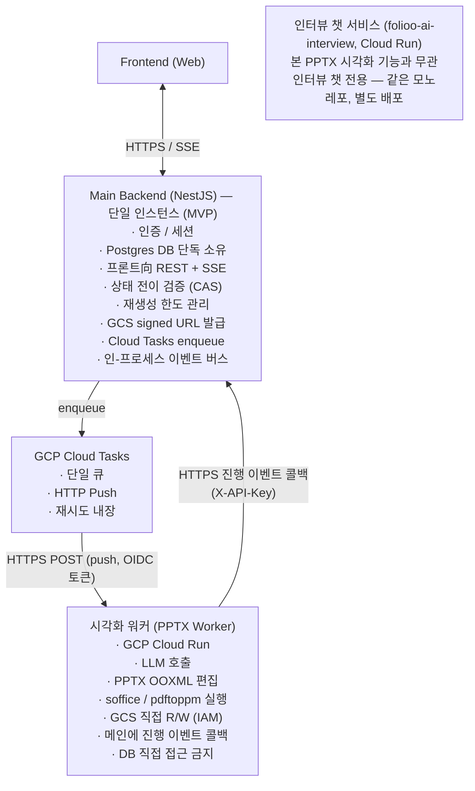
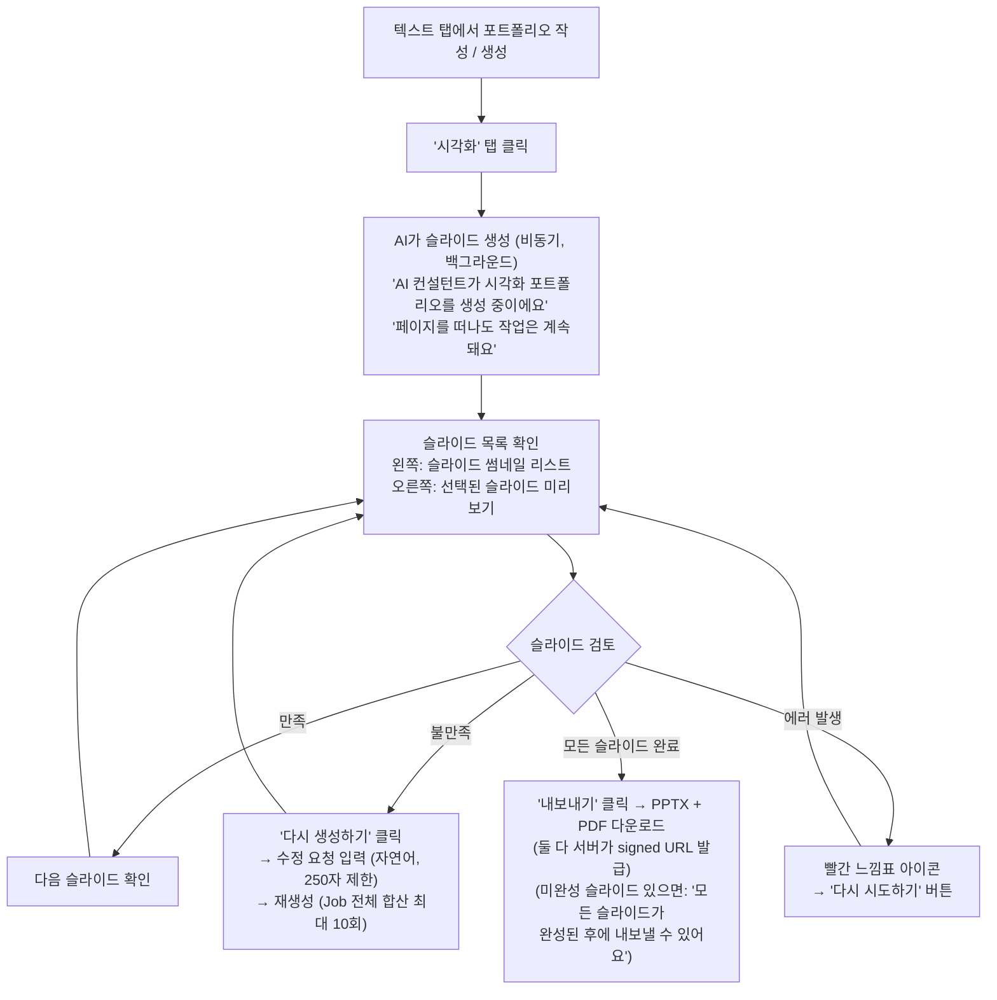
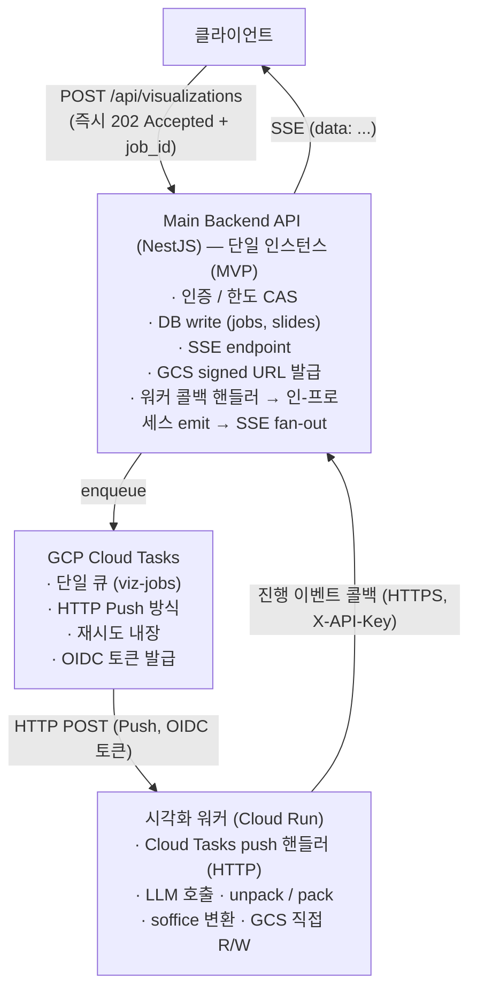
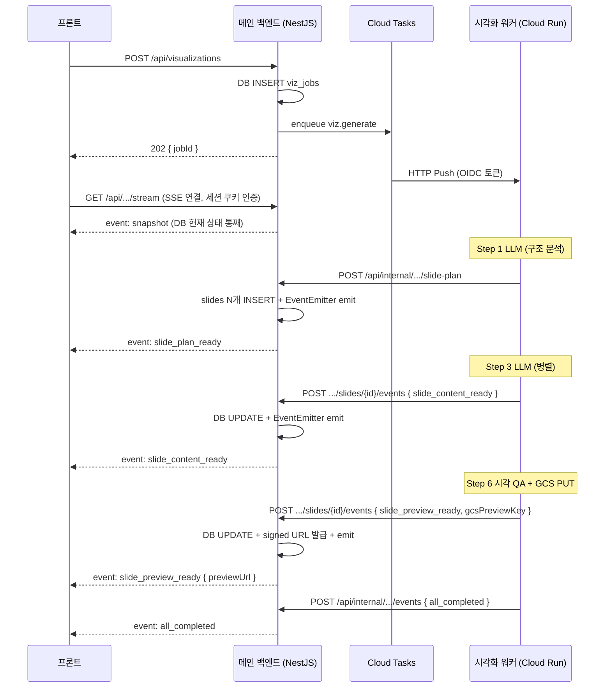
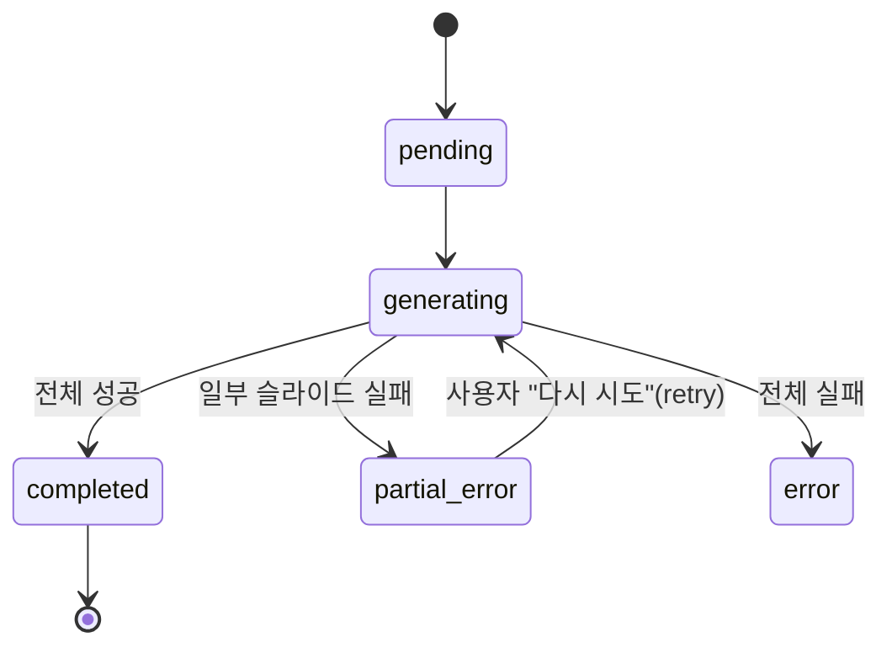
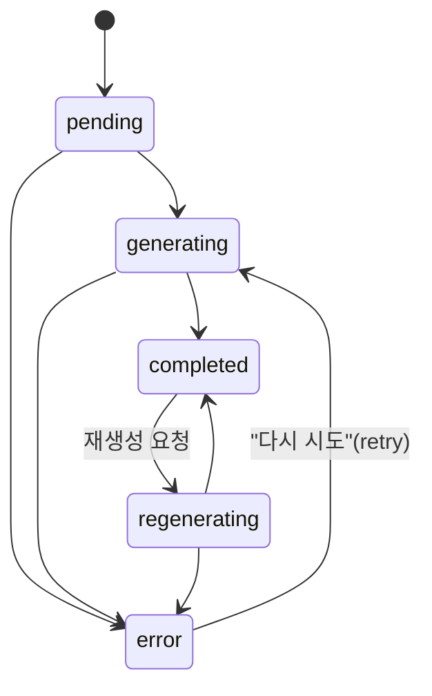

# FOLIOO 포트폴리오 시각화 기능 — 기획 및 설계 총정리 문서

---

## 1. 서비스 개요

### 1.1 현재 서비스
FOLIOO는 포트폴리오 텍스트를 생성해주는 서비스.

### 1.2 추가 기능
기존에 생성된 포트폴리오 텍스트를 **PPT(슬라이드) 형태로 시각화**해주는 기능을 추가한다.

### 1.3 핵심 컨셉
- 완전 자율 생성이 아닌, **내부 템플릿 기반 생성**
- 하나의 템플릿 PPTX 파일에 같은 디자인 시스템을 공유하는 **다양한 레이아웃 페이지(30~40장)를 풀(Pool)로 보유**
- LLM이 포트폴리오 내용을 분석하여 **최적의 페이지들을 선택**하고, 선택된 페이지들로 새 파일을 구성
- 단순 텍스트 교체가 아닌, LLM의 능력을 활용하여 **텍스트 길이에 따른 폰트 크기 조정, 줄바꿈 최적화, 콘텐츠 요약** 등을 자동 수행
- 사용자가 슬라이드별로 **확인하고 수정 요청을 반복**할 수 있는 구조 지원
- 현재 MVP에서는 **색상 조합만 다른 여러 템플릿 파일**을 제공하고, 추후 완전히 다른 디자인 시스템의 템플릿을 추가 확장

### 1.4 시스템 아키텍처

FOLIOO 의 PPT 시각화 기능은 **세 개의 서비스가 협력**하는 마이크로서비스 구조다.
본 문서의 모든 흐름·API 는 아래 책임 분리를 전제로 기술된다.

#### 1.4.0 주요 용어 정의 (반드시 먼저 숙지)

문서 곳곳에서 "AI", "AI 서버", "AI Worker", "워커" 등 비슷해 보이는 표현이 혼용되기 쉬우므로,
**본 문서에서는 다음 세 가지 용어만 사용한다.**

| 용어 | 정의 | 배포 단위 | 본 시각화 기능과의 관계 |
|---|---|---|---|
| **메인 백엔드 (Main Backend)** | NestJS 기반 백엔드. 사용자 인증/세션, Postgres, 프론트向 REST/SSE, Cloud Tasks enqueue, signed URL 발급, 동시성 제어 담당. | 단일 인스턴스 (MVP) | **본 기능의 모든 사용자向 트래픽이 통과하는 단일 진입점**. |
| **시각화 워커 (PPTX Worker)** | 본 PPTX 시각화 기능 전용 워크로드 핸들러. Cloud Tasks 로부터 받은 HTTP Push 를 받아 LLM 호출 + OOXML 편집 + soffice/pdftoppm 실행 + GCS R/W 를 모두 수행하고, 진행 이벤트를 메인 백엔드에 HTTP 콜백으로 전달. | **별도 배포 단위** (GCP Cloud Run Service). 본 `folioo-ai` 코드베이스와는 **독립 서비스**로 운영하되, LLM 호출 등 공통 라이브러리는 재사용 가능. | **본 기능의 모든 무거운 작업(LLM·OOXML·soffice)을 처리하는 주체**. |
| **인터뷰 챗 서비스 (Interview Chat)** | 포트폴리오 인터뷰 챗용 FastAPI 서비스. LLM 토큰을 사용자에게 직접 SSE 스트리밍. | **별도 Cloud Run 배포** (`folioo-ai-interview`, ADR-0001) | **본 PPTX 시각화 기능에는 관여하지 않는다.** 시각화 워커와 같은 `folioo-ai` 모노레포에서 빌드되지만 런타임 경로엔 등장하지 않는다. |

> **앞으로 본 문서에서 "워커" 라고만 적으면 항상 "시각화 워커(PPTX Worker)" 를 의미한다.**
> 본 문서에는 더 이상 "AI Worker" / "AI Worker 풀" / "AI 서버 워커" 같은 표현을 사용하지 않는다.
> 그리고 **"AI 서버 / folioo-ai" 는 런타임이 아니라 모노레포(레포·빌드 단위) 이름**이다 — 런타임은
> **시각화 워커(`folioo-ai-pptx-worker`)** 와 **인터뷰 챗 서비스(`folioo-ai-interview`)** 두 Cloud Run
> 배포뿐이다 (ADR-0001, CONTEXT.md). 인터뷰 챗 서비스는 본 시각화 기능과 무관하다.

이전 버전(v4 까지)에서 "AI 서버가 LLM·OOXML·soffice 를 모두 처리한다" 고 기술했던 부분은,
v5 부터는 **모두 "시각화 워커가 처리한다" 로 대체**되었다. 인터뷰 챗 서비스는 본 기능의 런타임 경로에
포함되지 않는다.

v6 부터는 시각화 워커의 실행 환경을 **GCP Cloud Run Service 로 확정**하고(§7.0.1), 검토 단계에서
비교했던 Cloud Run Jobs / Daytona / GKE / Fargate 등 대안 서술은 문서에서 제거했다.
원조 Anthropic PPTX 스킬 같은 **코드 실행 모델**과 그에 필요한 강격리 샌드박스(Daytona 등)로의
전환은 MVP 이후로 미룬다(§17).

#### 1.4.1 아키텍처 다이어그램



> **MVP 단계 가정 — 단일 메인 인스턴스**
> 본 문서의 SSE 푸시 메커니즘은 **메인 백엔드가 단일 인스턴스로 동작**한다는 가정 위에 설계되었다.
> 따라서 워커 콜백 → SSE fan-out 은 **NestJS 프로세스 내부의 EventEmitter (또는 RxJS Subject)**
> 만으로 처리하고, **Redis Pub/Sub 같은 외부 메시지 브로커는 사용하지 않는다.**
> 인스턴스 다중화 시점에 Pub/Sub (Redis Pub/Sub / Redis Streams / NATS 등) 으로 확장한다 — §7.5.4 참조.

#### 1.4.2 책임 매트릭스

| 영역 | 메인 백엔드 (NestJS) | 시각화 워커 (PPTX Worker) | 인터뷰 챗 서비스 (folioo-ai) |
|---|---|---|---|
| 사용자 인증/세션 | ✅ 단독 | ❌ | ❌ |
| 프론트 SSE 종단점 | ✅ 단독 (`GET /api/visualizations/{job_id}/stream`) | ❌ | ❌ |
| Postgres 읽기/쓰기 | ✅ 단독 소유 | ❌ (직접 접근 금지, 메인 internal API 경유) | ❌ |
| 재생성 한도 / 상태 전이 CAS | ✅ 원자적 트랜잭션 | ❌ | ❌ |
| Cloud Tasks enqueue | ✅ (사용자 요청 진입점) | ❌ (워커는 소비자) | ❌ |
| Cloud Tasks HTTP Push 수신 | ❌ | ✅ (push 핸들러 노출) | ❌ |
| GCS signed URL 발급 | ✅ (프론트 다운로드용) | ❌ (자체 다운로드/업로드는 IAM 직접) | ❌ |
| GCS 객체 직접 R/W | ❌ (메타정보만 알면 됨) | ✅ (PPTX/프리뷰 처리) | ❌ |
| LLM 호출 (구조 분석/콘텐츠/QA/수정 해석) | ❌ | ✅ | ❌ (본 기능 한정) |
| PPTX OOXML 편집 | ❌ | ✅ | ❌ |
| soffice / pdftoppm 실행 | ❌ | ✅ | ❌ |
| 진행 이벤트 발행 | ✅ (인-프로세스 EventEmitter → SSE) | ✅ (HTTP 콜백으로 메인에 전달) | ❌ |
| 재생성 / 내보내기 요청 검증 | ✅ (한도, 상태) | ❌ (메인이 전달한 요청 신뢰) | ❌ |
| 인터뷰 챗 등 비-시각화 AI 기능 | ❌ (위임 호출만) | ❌ | ✅ |

#### 1.4.3 통신 패턴

다섯 가지 채널이 동시에 사용된다.

| # | 채널 | 방향 | 용도 | 본 문서 위치 |
|---|---|---|---|---|
| 1 | HTTPS (동기) | Frontend → Main | 사용자 요청 수신 | §11.1 |
| 2 | SSE (단방향 push) | Main → Frontend | 진행 상황 실시간 푸시 | §7.1 |
| 3 | Cloud Tasks enqueue | Main → Cloud Tasks | 작업 큐잉 (`viz.generate` / `viz.regenerate`) | §7.0 |
| 4 | HTTPS (동기, OIDC) | Cloud Tasks → 시각화 워커 | HTTP Push 로 작업 dispatch | §7.0 / §11.2 |
| 5 | HTTPS (동기, X-API-Key) | 시각화 워커 → Main | 진행 이벤트/결과 콜백, 컨텍스트 조회 | §11.3 |
| 6 | 인-프로세스 EventEmitter | Main 내부 | 콜백 핸들러 → SSE 핸들러 fan-out (워커는 직접 emit 안 함) | §7.5 |

**서비스 간 호출 인증:**
- Cloud Tasks → 워커: GCP OIDC 서비스 계정 토큰 (Cloud Tasks 표준)
- 워커 → 메인 (콜백): `X-API-Key`
- 메인 → 인터뷰 챗 서비스 (인터뷰 챗 등 별도 기능): 본 시각화 문서 범위 밖

자세한 통신 규약(envelope, 재시도, 필드명 매핑)은 §11.0 참조.

#### 1.4.4 데이터 흐름 요약 (Phase 1 기준)

```
① 프론트 → 메인:        POST /api/visualizations
② 메인:                 DB row INSERT (visualization_jobs, status=pending)
③ 메인 → Cloud Tasks:   enqueue viz.generate
                        { jobId, portfolioId, templateId,
                          callbackBaseUrl, ... }
                        (portfolioText 는 페이로드 미포함 — 워커가 internal API 조회)
④ 메인 → 프론트:        202 Accepted { jobId }   (③ 성공 직후 즉시 응답)
                        + 프론트가 GET /api/.../stream 으로 SSE 연결 시작
⑤ Cloud Tasks → 워커:   HTTP POST {WORKER_URL}/tasks/visualizations/generate
                        (OIDC 토큰 검증, 재시도는 Cloud Tasks 관리)
⑥ 워커:                 LLM Call #1 (구조 분석)
⑦ 워커 → 메인:          POST /api/internal/visualizations/{jobId}/slide-plan
                        (slide_plan_ready, slides 메타 일괄 생성 요청)
⑧ 메인:                 visualization_slides N개 INSERT
                        + 인-프로세스 EventEmitter emit
⑨ 메인 → 프론트:        SSE: pipeline_stage_changed: contentGenerating
                              + slide_plan_ready (스켈레톤)
⑩ 워커:                 슬라이드별 LLM Call #2 (병렬)
⑪ 워커 → 메인:          POST /api/internal/.../slides/{slideId}/events
                        (slide_content_ready 등)
⑫ 메인:                 DB UPDATE + EventEmitter emit → SSE
⑬ 워커:                 pack / PDF 변환 / 시각 QA / GCS 업로드
⑭ 워커 → 메인:          slide_preview_ready (gcsPreviewKey)
⑮ 메인:                 signed URL 발급해 SSE 동봉 → 프론트
⑯ 워커 → 메인:          all_completed (최종 status 갱신)
                        + Cloud Tasks 에 200 OK 응답 (작업 완료 ACK)
⑰ 메인 → 프론트:        SSE: all_completed
```

이 책임 분리를 기준으로 §5 이후의 모든 단계는 **`[메인]` / `[워커]` 라벨**로 어느 서비스가
수행하는지 명시한다. `[AI]` 라벨은 본 문서에서 더 이상 사용하지 않는다.

---

## 2. UX 플로우

### 2.1 전체 사용자 흐름



### 2.2 상태 표시 (2단계)

UI는 2개 단계로 구성하되, **두 단계 모두 슬라이드별 incremental 진행 상태를 표시**한다.
pack 자체는 1회로 묶이지만, 시각 QA·프리뷰 업로드는 슬라이드별로 병렬 처리되므로
"먼저 끝난 슬라이드부터 사용자에게 노출"하는 것이 가능하다.

```
단계 A: "AI가 콘텐츠를 구성하고 있어요" (LLM 호출 중, Step 3)
  → 슬라이드별 진행 상태 표시
  → LLM 응답 완료 시 해당 슬라이드 "콘텐츠 준비 완료" ✅ (slide_content_ready)
  → LLM 실패 시 해당 슬라이드 에러 ❌ (slide_content_error)

단계 B: "슬라이드를 완성하고 있어요" (pack/render/QA, Step 4~6)
  → pack + PDF 변환은 전체 1회 (슬라이드별로 쪼갤 수 없음)
     · 이 구간은 "렌더링 중" 단일 진행 표시 (pipeline_stage_changed: rendering)
  → 시각 QA + 프리뷰 업로드는 슬라이드별 병렬
     · 통과한 슬라이드부터 즉시 SSE로 푸시 (slide_preview_ready)
     · 사용자는 빠른 슬라이드부터 미리보기를 보면서 검토 시작 가능
  → 모든 슬라이드 완료 시 all_completed
```

---

## 3. 템플릿 시스템

> **별도 문서로 분리됨 → [`template-system.md`](./template-system.md)**
>
> 템플릿 파일 구조, Source Slide 카테고리 표준 Enum, `meta.json` 설계, 템플릿 등록
> 파이프라인, 디자이너 워크플로우, 자동 Slot 인식 원리를 다룬다.
> 절 번호 §3.x 는 분리 문서 안에서 그대로 유지되므로, 본 문서의 §3.x 참조는
> `template-system.md` 의 같은 절을 가리킨다.

**핵심 요약:**
- Template 1개 = 색상 조합 1종. `template.pptx`(30~40장 Source Slide 풀) + `meta.json` + `thumbnail.jpg`
- Source Slide 카테고리는 전 Template 공유 **표준 Enum** (`cover` / `overview` / `process` / `chart` / `closing` 등 10종)
- `meta.json` 은 Source Slide 선택에 필요한 최소 정보만 — Source Slide 별 5개 필드(`slide_index` / `id` / `category` / `description` / `best_for`). 사전 Slot 명세 없음
- Slot 은 런타임에 시각화 워커가 슬라이드 XML 의 `cNvPr/@id` + 좌표·텍스트·폰트로 LLM 에 넘겨 동적 식별 (§5.2 Step 3)
- 템플릿 등록은 자동 추출 → LLM 초안 → 운영자 검토 → 검증 → GCS 업로드의 반자동 파이프라인

---

## 4. 기술 스택 및 OOXML 편집 방식

> **별도 문서로 분리됨 → [`ooxml-editing.md`](./ooxml-editing.md)**
>
> Anthropic PPTX Skill 도구 체인, python-pptx 대신 OOXML 직접 편집을 택한 이유,
> DrawingML XML 편집 규칙, `SlideEditor` 구현(`extract_slots` / `apply_fills`)을 다룬다.
> 절 번호 §4.x 는 분리 문서 안에서 그대로 유지되므로, 본 문서의 §4.x 참조
> (예: §5.2 의 §4.4)는 `ooxml-editing.md` 의 같은 절을 가리킨다.

**핵심 요약:**
- Anthropic PPTX 스킬 도구 체인 (`unpack.py` / `clean.py` / `pack.py` / `validate.py` / `soffice.py` / `markitdown` 등)
- python-pptx 가 아닌 **OOXML 직접 편집** — 디자이너 서식을 95~99% 보존 (코드 재생성은 70~80% 유사도)
- XML 파서는 `defusedxml.minidom`, 텍스트는 명시적 노드 조작 (일괄 치환 금지), 도형 식별자는 `cNvPr/@id`
- `SlideEditor.extract_slots()` → Slot 디스크립터 추출(LLM 입력), `apply_fills()` → Fill 을 XML 에 적용 (원본 서식 보존)

---

## 5. 전체 실행 파이프라인

### 5.1 3개의 Phase

```
Phase 1: 초기 생성 (한 번)
  "텍스트 포트폴리오 → 전체 슬라이드 일괄 생성"

Phase 2: 확인 & 수정 루프 (반복)
  "슬라이드별로 보면서 수정 요청 → 재생성 → 확인 → 또 수정..."

Phase 3: 확정 & 내보내기 (한 번)
  "모든 슬라이드 확인 완료 → PPTX 내보내기"
```

### 5.2 Phase 1: 초기 생성 — 상세 흐름

> **책임 라벨 범례**
> - **[메인]** = NestJS Main Backend (인증, DB, SSE, GCS signed URL, 한도 관리, Cloud Tasks enqueue)
> - **[워커]** = 시각화 워커 (Cloud Run Service, LLM·OOXML·soffice·GCS R/W 담당)
>
> Phase 1 진입 트리거(`POST /api/visualizations`)는 **[메인]** 이 수신해서
> DB row 를 생성하고 **Cloud Tasks 로 작업을 enqueue** 한다. Cloud Tasks 는 HTTP Push 방식으로
> 시각화 워커의 핸들러(`POST {WORKER_URL}/tasks/visualizations/generate`)를 호출한다.
> 아래 Step 1~7 은 모두 **[워커]** 안에서 실행되며, 매 단계 종료 시
> 워커 → 메인 콜백(§11.3)으로 이벤트가 전달된다.

```
사용자: "시각화" 탭 클릭
         │
         ▼
[메인] POST /api/visualizations 수신
       │  - 인증 / portfolio 소유권 검증
       │  - visualization_jobs row INSERT (status=pending)
       │  - visualization_slides 는 Step 1 응답 후 일괄 생성
       │  - EventEmitter emit → SSE: pipeline_stage_changed: contentGenerating
       │
       ▼
[메인 → Cloud Tasks] enqueue viz.generate
       Body: { jobId, portfolioId, userId, templateId,
               callbackBaseUrl,
               idempotencyKey, schemaVersion }
       (portfolioText 는 페이로드에 싣지 않는다 — 워커가 §11.3 으로 조회)
       메인은 enqueue 성공 시 202 Accepted 즉시 응답 (jobId 반환)
         │
         ▼
[Cloud Tasks → 워커] HTTP POST {WORKER_URL}/tasks/visualizations/generate
       Headers: Authorization: Bearer <OIDC token>
                X-CloudTasks-TaskName, X-CloudTasks-QueueName
       (워커는 패턴 A — 이 요청 안에서 Step 1~7 을 동기 처리하며 중간 진행 이벤트를
        메인에 콜백으로 보내고, 모든 처리가 끝난 뒤 200 OK 로 응답한다.
        Cloud Tasks 는 그때까지 응답을 기다린다, dispatchDeadline 30분 — §7.0.2)
         │
         ▼
┌──────────────────────────────────────────────────────┐
│  [워커] Step 1: LLM Call #1 — 구조 분석 + 슬라이드 선택  │
│                                                       │
│  Input:                                               │
│  - 포트폴리오 텍스트 (텍스트 탭에서 생성된 내용)            │
│  - 템플릿 meta.json (각 슬라이드의 id, category,          │
│    description, best_for) ※ 사전 Slot 스펙은 없음       │
│  - Phase 1 구현은 텍스트 메타만 사용한다. 템플릿 썸네일      │
│    multimodal 입력은 모델/비용/지연 정책 확정 뒤 후속 처리  │
│                                                       │
│  하이브리드 매칭:                                        │
│  ① Rule-based 필터링 (빠르고 확실한 것)                   │
│     - 섹션 타입 → 해당 Source Slide 카테고리만 필터링      │
│     - 수치 데이터 없음 → chart Source Slide 제외           │
│     - 이미지 없음 → visual Source Slide 제외               │
│     - 직전 슬라이드와 같은 레이아웃 타입 제외               │
│     → 후보 2~3개로 축소                                  │
│                                                       │
│  ② LLM이 최종 선택 (구조 분석 호출에 통합, 추가 호출 없음)   │
│     - 콘텐츠 맥락을 보고 판단                             │
│     - reasoning 필드로 선택 근거 기록                      │
│                                                       │
│  Output: 슬라이드 선택 목록 + content_brief             │
│          (어떤 슬라이드에 어떤 "내용 요지"를 담을지 까지만,   │
│           구체적 Fill 결정은 Step 3 으로 미룸)            │
└──────────┬───────────────────────────────────────────┘
           │
           ▼
```

**LLM Call #1 프롬프트 설계:**

```
System Prompt:
"너는 포트폴리오 PPT 구성 전문가야.
 사용자의 포트폴리오 텍스트를 분석하고,
 주어진 Source Slide 풀에서 최적의 조합을 선택해."

User Prompt:
"[포트폴리오 텍스트]
 {portfolio_text}

 [사용 가능한 Source Slide 풀]
 {메타데이터에서 id, category, description, best_for만 발췌}

 다음 규칙을 따라서 슬라이드를 선택해:
 1. 반드시 cover 카테고리에서 1개, closing에서 1개를 포함할 것
 2. 같은 카테고리에서 연속 선택하지 말 것
 3. 포트폴리오 내용에 수치 데이터가 있으면 반드시 차트/성과 레이아웃 포함
 4. 총 슬라이드 수는 7~12장 범위로
 5. 각 슬라이드에 담을 '내용 요지'를 자연어로 함께 적어줘
    (어느 도형에 어떤 텍스트를 넣을지는 다음 단계에서 결정한다)"

Expected Output:
{
  "total_slides": 8,
  "slide_plan": [
    {
      "order": 1,
      "selected_slide_id": "cover_B",
      "reason": "프로젝트명이 22자로 길어서 좌측 정렬이 적합",
      "content_brief": "표지: 프로젝트명 '배달 앱 UX 개선 프로젝트',
                        작성자 '김철수 | 스타트업 PM',
                        기간 '2024.01 - 2024.06'"
    },
    {
      "order": 2,
      "selected_slide_id": "overview_A",
      "reason": "역할, 기간, 도구, 팀 구성이 명확히 4개로 나뉨",
      "content_brief": "개요 4칸: 역할(PM/서비스 기획),
                        기간(6개월), 도구(Figma/Notion),
                        팀(PM 1 + 디자이너 1 + 개발 3)"
    },
    ...
  ]
}
```

> Step 1 의 출력은 더 이상 **Slot 별 Fill 을 직접 채우지 않는다.**
> 대신 슬라이드별 `content_brief` 자연어 요지만 남기고, **실제 Fill 결정은 Step 3** 에서
> 슬라이드 XML 의 Slot 디스크립터를 본 LLM 이 결정한다.

```
┌──────────────────────────────────────────────────────┐
│  [워커 → 메인] Step 1 결과 콜백                          │
│                                                       │
│  POST /api/internal/visualizations/{job_id}/slide-plan │
│  Headers: X-API-Key                                    │
│  Body: {                                              │
│    totalSlides: 8,                                    │
│    slidePlan: {...},  slides: [...]  // §11.3         │
│    templateId: "blue",                                │
│    idempotencyKey, schemaVersion                      │
│  }                                                    │
│                                                       │
│  [메인] 처리:                                            │
│  - visualization_slides N개 일괄 INSERT                │
│      (status=pending, source_slide_id,                │
│       slide_filename, slide_order)                     │
│  - visualization_jobs.total_slides 갱신                │
│  - EventEmitter emit → SSE: slide_plan_ready          │
│    (프론트가 스켈레톤 N장 즉시 렌더링 가능)                  │
└──────────┬───────────────────────────────────────────┘
           │
           ▼
┌──────────────────────────────────────────────────────┐
│  [워커] Step 2: 작업 파일 생성 (샌드박스 내)               │
│                                                       │
│  ① GCS에서 templates/blue/template.pptx 다운로드          │
│     - 워커가 IAM 역할로 직접 GCS GET (메인 경유 X)          │
│                                                       │
│  ② unpack.py로 PPTX 해제                               │
│     → /tmp/working/ 디렉터리                            │
│     (XML pretty-print + 스마트따옴표 이스케이프)            │
│                                                       │
│  ③ presentation.xml에서 미선택 슬라이드 sldId 제거         │
│     (LLM이 선택하지 않은 슬라이드들)                        │
│                                                       │
│  ④ clean.py 실행                                       │
│     → 고아 슬라이드 XML/rels/미디어/ContentTypes 정리      │
│                                                       │
│  결과: 선택된 슬라이드만 남은 깨끗한 unpacked 디렉터리        │
└──────────┬───────────────────────────────────────────┘
           │
           ▼
┌──────────────────────────────────────────────────────┐
│  [워커] Step 3: 슬라이드별 콘텐츠 편집 (병렬)              │
│                                                       │
│  하나의 샌드박스 안에서 XML 편집만 병렬:                     │
│                                                       │
│  ┌─ Thread per slide ─────────────────────────────┐    │
│  │  ① SlideEditor.extract_slots(slide1.xml)        │    │
│  │     → Slot 디스크립터 목록 (§4.4) 자동 생성        │    │
│  │       [{shape_id, x_emu, y_emu, w_emu, h_emu,    │    │
│  │         current_text, is_title_placeholder,      │    │
│  │         font_size_pt, kind}, ...]                │    │
│  │                                                  │    │
│  │  ② LLM Call #2: Slot → Fill 결정                   │    │
│  │     Input:                                        │    │
│  │     - 위 Slot 디스크립터 목록                        │    │
│  │     - content_brief (Step 1 의 해당 슬라이드 요지)   │    │
│  │     - (선택) slide1.xml markitdown 결과             │    │
│  │     ※ 사전 Slot 스펙은 입력하지 않는다 —             │    │
│  │       LLM 이 Slot 의 위치·크기·현재 텍스트만 보고      │    │
│  │       역할(title/body/card_body/...) 을 스스로 판단 │    │
│  │                                                  │    │
│  │     Output:                                      │    │
│  │     {                                            │    │
│  │       "<shape_id>": {                            │    │
│  │         "role": "title",                         │    │
│  │         "action": "text",                        │    │
│  │         "text": "...",                           │    │
│  │         "font_size_override": 28,                │    │
│  │         "is_title": true                         │    │
│  │       },                                         │    │
│  │       "<shape_id_unused>": { "action":           │    │
│  │         "remove" }   // 콘텐츠 수 부족 시        │    │
│  │       // 차트는 같은 맵에 action:"chart" 엔트리  │    │
│  │     }                                            │    │
│  │                                                  │    │
│  │  ③ SlideEditor.apply_fills(slide1.xml, fills)    │    │
│  │     → DrawingML 규칙 준수하며 텍스트/제거 적용      │    │
│  └──────────────────────────────────────────────────┘    │
│  ┌─ Thread 2: slide2.xml (동일 과정) ──────────────┐     │
│  └──────────────────────────────────────────────────┘    │
│  ┌─ Thread 3: slide3.xml (동일 과정) ──────────────┐     │
│  └──────────────────────────────────────────────────┘    │
│  ...                                                     │
│                                                          │
│  LLM 호출은 병렬 (각자 다른 슬라이드 담당)                    │
│  XML 파일이 다르니까 충돌 없음                                │
│                                                          │
│  슬라이드별로 LLM 응답이 도착할 때마다                         │
│  [워커 → 메인] POST /api/internal/visualizations/{job_id}│
│                /slides/{slide_id}/events                 │
│                Body: { event: "slide_content_ready",     │
│                        currentFills: {...} }             │
│  [메인] DB 갱신 + EventEmitter emit → SSE                  │
│                                                          │
│  특정 슬라이드의 Call #2 가 1회 timeout 재시도 후에도 실패하면 │
│  템플릿 예시 문구가 노출되지 않도록 해당 슬라이드 XML 의 콘텐츠 │
│  도형을 모두 제거해 완전 빈 페이지로 만든다. 이 슬라이드는       │
│  `slide_content_error` 로 보고하고 QA/preview 대상에서 제외   │
│  하되, slideOrder 와 PDF page 번호가 어긋나지 않도록 deck 에는 │
│  그대로 남긴다.                                            │
└──────────┬─────────────────────────────────────────────┘
           │
           ▼
┌──────────────────────────────────────────────────────┐
│  [워커] Step 4: 패킹 + 검증 (모든 슬라이드 편집 완료 후 1회)│
│                                                       │
│  ① pack.py --original template.pptx                    │
│     - XML condense (a:t 제외)                          │
│     - ZIP DEFLATE로 패키징                              │
│     - 원본 대비 검증                                    │
│                                                       │
│  ② PPTXSchemaValidator 검증                            │
│     - 웰포름드 XML                                     │
│     - 네임스페이스 / ID 유일성                            │
│     - relationship 참조 정합                            │
│     - ContentTypes 정합                                │
│     - XSD 검증 (원본에도 있던 오류는 차감)                  │
│                                                       │
│  ③ 검증 실패 시                                         │
│     → repair() 시도 (whitespace preservation 등)        │
│     → 재검증                                           │
│     → 그래도 실패 시 에러 처리 (상세 §13)                  │
│                                                       │
│  결과: /tmp/portfolio.pptx (검증 통과)                    │
│                                                       │
│  [워커 → 메인] POST /api/internal/visualizations/{job_id}│
│                /events                                  │
│                Body: { event: "pipeline_stage_changed",           │
│                        pipelineStage: "rendering" }       │
└──────────┬───────────────────────────────────────────┘
           │
           ▼
┌──────────────────────────────────────────────────────┐
│  [워커] Step 5: PDF/이미지 생성 (전체 1회)                │
│                                                       │
│  ① soffice → PDF 변환 (전체 1회)                         │
│     soffice.py --headless --convert-to pdf             │
│     → PPTX 한 파일을 통째로 PDF로 (슬라이드별 분리 X)        │
│                                                       │
│  ② pdftoppm → 페이지별 JPG (1회 호출, N장 출력)            │
│     pdftoppm -jpeg -r 150 output.pdf slide             │
│     → slide-01.jpg, slide-02.jpg, ... 동시에 떨어짐       │
│                                                       │
│  ※ 이미지는 아직 사용자에게 노출 X (시각 QA 후 Step 6)        │
└──────────┬───────────────────────────────────────────┘
           │
           ▼
┌──────────────────────────────────────────────────────┐
│  [워커] Step 6: 시각 QA + 업로드 (슬라이드별 병렬)          │
│                                                       │
│  슬라이드별로 다음을 병렬 실행:                              │
│                                                       │
│  ┌─ Thread per slide ─────────────────────────────┐    │
│  │  ① LLM 비전 호출 (시각 QA)                       │    │
│  │     체크리스트:                                  │    │
│  │     · 텍스트 오버플로우/잘림 없는지                │    │
│  │     · 요소 겹침 없는지                            │    │
│  │     · 빈 Slot 이 남아있지 않은지                  │    │
│  │     · 텍스트가 읽기 어려울 정도로 작지 않은지        │    │
│  │                                                │    │
│  │  ② 통과한 경우:                                  │    │
│  │     [워커] GCS 업로드: jobs/{job_id}/previews/    │    │
│  │            slide-{slide_order:02d}.jpg (IAM PUT)  │    │
│  │     [워커 → 메인] POST .../slides/{slide_id}/events│  │
│  │            Body: { event: "slide_preview_ready", │    │
│  │                    gcsPreviewKey: "...",          │    │
│  │                    width, height, byteSize }     │    │
│  │     [메인] DB: slides[N].status = 'completed'    │    │
│  │            gcs_preview_key 갱신                    │    │
│  │            → EventEmitter emit → SSE              │    │
│  │            (preview_url 은 메인이 signed로      │    │
│  │             발급해 SSE 페이로드에 동봉)              │    │
│  │                                                │    │
│  │  ③ 이슈 있는 경우 → fix-and-verify 큐에 적재       │    │
│  └────────────────────────────────────────────────┘    │
│                                                        │
│  Fix-and-verify 루프 (이슈 슬라이드만):                    │
│  ① 이슈 슬라이드들의 XML을 LLM 지시대로 일괄 수정             │
│  ② pack 1회 + PDF 변환 1회 (배치)                         │
│  ③ 영향 받은 슬라이드만 다시 시각 QA                         │
│  ④ 통과하면 위와 동일하게 업로드 + 이벤트 콜백                │
│  ⑤ 최대 2회 시도, 그래도 실패면 해당 슬라이드 error           │
│     [워커 → 메인] event: slide_preview_error             │
└──────────┬─────────────────────────────────────────────┘
           │
           ▼
┌──────────────────────────────────────────────────────┐
│  [워커] Step 7: PPTX/PDF 업로드 + 샌드박스 정리            │
│                                                       │
│  ① GCS 업로드:                                          │
│     - portfolio.pptx → jobs/{job_id}/current.pptx      │
│     - output.pdf     → jobs/{job_id}/current.pdf       │
│       (IAM 직접 PUT)                                   │
│     - 프리뷰 이미지는 Step 6에서 이미 업로드됨             │
│                                                       │
│  ② [워커 → 메인] POST /api/internal/visualizations/    │
│                   {job_id}/events                      │
│                   Body: { event: "all_completed",      │
│                           gcsPptxKey: "jobs/{id}/...",  │
│                           summary: {                   │
│                             completed: N, failed: M } }│
│     [메인] visualization_jobs.status 갱신:               │
│            - 모두 완료 → completed                       │
│            - 일부 실패 → partial_error                   │
│            - 전체 실패 → error                          │
│            gcs_pptx_key 갱신                            │
│            → EventEmitter emit → SSE                   │
│                                                       │
│  ③ 샌드박스 정리 (임시 파일 전부 삭제)                      │
└──────────────────────────────────────────────────────┘
```

**Step 5/6 분리 이유:**
- soffice/pdftoppm은 파일 단위 1회 호출이 가장 효율적 (페이지별 분리 호출은 오버헤드 큼)
- 시각 QA는 LLM 비전 호출이라 슬라이드별 병렬화 시 레이턴시 이득이 큼
- 사용자 입장에서 "빠른 슬라이드부터 즉시 확인 가능" → UX 개선

**Anthropic PPTX 스킬 원칙:**
- 렌더 결과를 시각 QA로 최소 한 번 검증한 뒤에야 완료 선언 (이슈 없으면 그 1회 검증으로 통과, 있으면 fix-and-verify 반복)
- 재검증 시 영향 받은 슬라이드만 검사 (전체 재검사 X)

### 5.3 Phase 2: 확인 & 수정 루프 — 상세 흐름

```
사용자: 슬라이드 3 선택 → "다시 생성하기" → "제목 크기 키워줘"
         │
         ▼
[메인] POST /api/visualizations/{job_id}/slides/{slide_id}/regenerate
       │  ── §7.4 트랜잭션 (Job row lock + Slide CAS + 한도) ──
       │  - regeneration_count < MAX_REGENERATIONS (전역 상수) ?
       │  - slide.status == 'completed' ?
       │  - 같은 Job 안에 다른 `generating` / `regenerating` Slide 없음 ?
       │  - 통과 시: slide.status='regenerating', count+=1
       │  - 실패 시: 429 QUOTA_EXHAUSTED / 409 SLIDE_BUSY / 409 JOB_BUSY
       │
       │  ── 메인 → Cloud Tasks enqueue (커밋 후 best-effort) ──
       │     payload: { messageType: "viz.regenerate",
       │                jobId, slideId, userRequest,
       │                idempotencyKey, callbackBaseUrl,
       │                schemaVersion }
       │
       │  ── 메인 → 프론트 즉시 200 응답 ──
       │     Body: { slideId, remainingRegenerations }
       │
       │  ── 메인 → EventEmitter emit → SSE: slide_regenerating ──
       ▼
[Cloud Tasks → 워커] HTTP POST {WORKER_URL}/tasks/visualizations/regenerate
                     (OIDC 토큰 + 멱등 키 검증)
         │
         ▼
┌─ [워커] 샌드박스 시작 ────────────────────────────────┐
│                                                      │
│  ① 메인에서 컨텍스트 조회                                 │
│     GET /api/internal/visualizations/{job_id}/slides   │
│         /{slide_id}                                   │
│     - currentFills                                   │
│     - sourceSlideId                                  │
│                                                      │
│  ② GCS에서 jobs/{job_id}/current.pptx 다운로드 (IAM 직접) │
│                                                      │
│  ③ unpack.py → /tmp/working/                         │
│                                                      │
│  ④ LLM Call: 수정 요청 해석 + XML 변경 지시              │
│     Input:                                           │
│     - slideN.xml 현재 내용                             │
│     - 사용자 요청: "제목 크기 키워줘"                     │
│                                                      │
│     System Prompt:                                   │
│     "현재 슬라이드 스펙과 사용자의 수정 요청이 주어져.      │
│      요청을 해석해서 구체적 XML 변경 사항을 알려줘.         │
│                                                      │
│      규칙:                                            │
│      - 사용자가 텍스트 변경을 명시한 경우만 텍스트 수정     │
│      - 요소가 슬라이드 밖으로 나가면 안 돼                 │
│      - 폰트 크기는 10pt~48pt 범위 내에서                 │
│      - 수정하지 않는 요소는 절대 건드리지 마"                │
│                                                      │
│  ⑤ slideN.xml 수정 (defusedxml.minidom)               │
│                                                      │
│  ⑥ pack.py --original current.pptx                    │
│                                                      │
│  ⑦ soffice → PDF → 슬라이드 N만 JPG                    │
│     pdftoppm -jpeg -r 150 -f N -l N                   │
│                                                      │
│  ⑧ 시각 QA (슬라이드 N만)                               │
│     → 이슈 있으면 ④~⑥ 반복 (최대 2회)                   │
│                                                      │
│  ⑨ GCS 업로드 (IAM 직접):                               │
│     - updated.pptx → current.pptx (덮어쓰기)           │
│     - output.pdf   → current.pdf (덮어쓰기)             │
│     - 새 slide-{slide_order:02d}.jpg → previews/      │
│                                                      │
│  ⑩ [워커 → 메인] 결과 콜백                               │
│     POST /api/internal/visualizations/{job_id}        │
│          /slides/{slide_id}/events                    │
│     Body: {                                          │
│       event: "slide_regenerated",                    │
│       currentFills: {...},                           │
│       gcsPreviewKey: "jobs/.../previews/slide-03.jpg", │
│     }                                                │
│     [메인] DB 갱신:                                     │
│     - visualization_slides: status='completed',       │
│       current_fills, gcs_preview_key, updated_at      │
│     → EventEmitter emit → SSE: slide_regenerated       │
│                                                      │
│  ⑪ 샌드박스 정리                                       │
└──────────────────────────────────────────────────────┘
         │
         ▼
사용자 확인 → 만족? → 다음 슬라이드
              불만족? → "다시 생성하기" (위 과정 반복, Job 전체 최대 10회)
```

**실패 시 동작:**
- 워커가 LLM/QA/렌더링 실패 시 `POST .../events` 로 `slide_preview_error` 발신
- 일반 재생성(`isRetry=false`) 실패: 메인은 슬라이드 status 를 `completed` 로 롤백 +
  `regeneration_count` 도 -1 보상 (CAS 트랜잭션 안에서 `decrement_job_regeneration_count` SQL 호출)
- retry(`isRetry=true`) 실패: 슬라이드는 `error` 로 되돌리고, 재생성 한도는 애초에 차감하지 않았으므로
  카운터 보상도 하지 않는다
- 메인 → SSE: `slide_preview_error` (사용자에게 "다시 시도" 버튼 노출)
- Cloud Tasks 재시도 정책(지수 백오프)도 워커가 5xx 를 반환하면 자동 동작
- 재시도가 모두 소진돼도 워커가 끝내 콜백을 못 보내면, 슬라이드는 `regenerating` 에
  남고 §7.4.4 stuck 복구 크론이 `error` 로 전이 + 카운터 보상

**재시도(retry) 변형 — `isRetry=true` (§11.1 `/retry`):**

위 흐름과 **꼬리(unpack → clean → 1장 수정 → pack → 해당 페이지 render → QA → 업로드 → 콜백)는 동일**하되,
**머리(④ "새 내용 계산")만 다르다.**

| 항목 | 재생성 `isRetry=false` (사용자 불만족) | 재시도 `isRetry=true` (생성 실패 복구) |
|---|---|---|
| 대상 슬라이드 | `completed` → `regenerating` | `error` → `generating` (§12.2) |
| ④ 머리 입력 | `userRequest` 해석 | **`content_brief` 로 채움** (Phase 1 Step 3 로직) |
| `userRequest` | 있음 | **없음** (메인이 안 보냄) |
| content_brief 출처 | (불필요) | `jobs.slide_plan` 의 해당 슬라이드 항목 (§10.2) |
| 한도 차감 | O (CAS, §7.4.3) | **X** (§14) |
| 결과 콜백 | `slide_regenerated` | `slide_regenerated` (동일) |
| 실패 시 최종 상태 | 직전 `completed` 로 롤백 + 카운터 보상 | `error` 로 복귀, 카운터 보상 없음 |

- retry 는 `userRequest` 대신 **저장된 `content_brief`** 를 LLM 입력으로 써서 해당 슬라이드를 다시 채운다.
- retry 는 **`current.pptx` 가 존재하는 `partial_error` Job 에만** 적용된다. Job 전체가 `error` 라
  `current.pptx` 가 없으면 per-slide retry 가 아니라 **Job 전체 재생성**으로 처리한다(§13).
- retry 로 마지막 `error` 슬라이드가 `completed` 가 되면, 그 `slide_regenerated` 콜백 처리에서 메인이 **`job.status` `partial_error`→`completed`** 로 재평가한다(이벤트 기반, §11.3·§12.1). 크론(§7.4.4)은 워커 급사 안전망일 뿐 이 정상 경로엔 관여하지 않는다.

### 5.4 수정 가능 범위 (가드레일)

> **별도 문서로 분리됨 → [`qa-and-guardrails.md`](./qa-and-guardrails.md)**
>
> Phase 2 에서 사용자가 바꿀 수 있는 범위(폰트/색/도형/레이아웃 제한),
> 텍스트 내용 변경 가드 규칙, 향후 확장(슬라이드 간 동기화·undo)을 다룬다.
> 절 번호 §5.4.x 는 분리 문서 안에서 그대로 유지되므로, 본 문서의 §5.4.x 참조는
> `qa-and-guardrails.md` 의 같은 절을 가리킨다.

**핵심 요약:**
- 수정 가능: 폰트 크기(10~48pt)·색(브랜드 팔레트)·도형 크기/색/위치. 레이아웃은 같은 카테고리 내 템플릿 전환만(⚠️ 제한적). 슬라이드 추가/삭제 ❌
- 텍스트 내용 변경은 **사용자가 명시 요청한 경우만**, 지정한 shape_id 만 변경. 변경 후 **시각 QA 강제 실행**(오버플로우 자동 보정)
- max_chars 사전 제한 없음 — 길이 초과는 시각 QA(§6)가 폰트 축소/요약으로 보정

### 5.5 Phase 3: 내보내기

내보내기는 **PPTX 와 PDF 둘 다 서버가 발급**한다. PDF 는 워커가 프리뷰 생성에 쓴
soffice 렌더 결과(`current.pdf`)를 그대로 보존해 둔 것이라, 별도 변환 없이 signed URL 만
발급하면 된다 — **클라이언트 측 변환은 하지 않는다.**

```
사용자: "내보내기" 클릭
         │
         ▼
[메인] POST /api/visualizations/{job_id}/export
       │
       ├─ §11.1.1 compute_can_export() 재검증
       │   - 미완성 슬라이드 있음 → 409 export_blocked + blockingSlides
       │
       └─ 모든 슬라이드 completed
           ① gcs_pptx_key 조회 (DB) + current.pdf 키 도출 (jobs/{id}/current.pdf)
           ② PPTX·PDF 각각 GCS signed GET URL 발급 (TTL 5분)
           ③ 즉시 200 OK + { pptxUrl, pdfUrl, expiresAt }
```

**처리 규칙:**
- 워커 호출도 큐잉도 없다. `current.pptx` 는 항상 검증된 최신 상태이므로
  메인이 GCS signed URL 만 발급해 동기 응답한다.
- 재생성이 일어나면 워커가 `current.pptx` 를 덮어쓴다. 다음 내보내기는 자동으로
  최신 파일을 가리키므로 별도의 캐시 무효화가 필요 없다.
- PDF 는 `current.pdf` (워커의 soffice 렌더 산출물, current.pptx 와 동일 렌더로 갱신)
  를 가리키므로 항상 PPTX 와 동기 상태다. 별도 변환·캐시 무효화가 필요 없다.

---

## 6. 시각 QA 시스템

> **별도 문서로 분리됨 → [`qa-and-guardrails.md`](./qa-and-guardrails.md)**
>
> 렌더된 슬라이드 이미지를 LLM 으로 검사하는 QA 프로세스(`VisualQA.check_slide`)와
> fix-and-verify 루프(최대 2회 자동 수정)를 다룬다.
> 절 번호 §6.x 는 분리 문서 안에서 그대로 유지되므로, 본 문서의 §6.x 참조는
> `qa-and-guardrails.md` 의 같은 절을 가리킨다.

**핵심 요약:**
- 프리뷰 이미지를 LLM 에 넘겨 오버플로우/겹침/미교체 안내문구/가독성/균형을 검사 (§5.2 Step 6)
- fix-and-verify: 이슈 발견 시 자동 수정 → 재프리뷰 → 재검사, **2회 시도에도 실패하면 에러**로 사용자에게 전달
- Anthropic 스킬 기준: 렌더→시각 QA 검증을 최소 한 번 거치기 전에는 성공 선언 금지(이슈 없으면 1회 검증으로 통과). 재검증은 영향 받은 슬라이드만

---

## 7. 비동기 처리 및 실시간 통신

### 7.0 작업 큐 + 시각화 워커 아키텍처

PPTX 생성 파이프라인은 LLM 호출 + soffice 변환 때문에 수~수십 초가 걸리므로
**메인 API 서버에서 동기 실행하지 않고 비동기 큐로 분리**한다.
본 시각화 기능에서는 **GCP Cloud Tasks (Push 방식)** 를 큐로 사용하며,
큐의 소비자는 **시각화 워커(PPTX Worker)** 다.
시각화 워커는 **인터뷰 챗 서비스와는 별개 Cloud Run 서비스**(같은 `folioo-ai` 모노레포) 로 배포한다 (§1.4.0, ADR-0001).

**MVP 단계 — 메인 백엔드는 단일 인스턴스로 운영한다.** 외부 메시지 브로커
(Redis Pub/Sub 등) 없이 **NestJS 프로세스 내부의 EventEmitter** 만으로
워커 콜백 → SSE fan-out 을 처리한다. 인스턴스 다중화는 §7.5.4 에서 다룬다.



**중요한 설계 결정 (인터뷰 챗 대비 차이점):**

본 PPTX 시각화 기능은 SSE 를 **메인 백엔드에서만 노출**하며, 시각화 워커는 SSE 를
열지 않는다. 같은 모노레포(folioo-ai)에서 빌드되는 인터뷰 챗 서비스는 LLM 토큰 단위 빠른 통과가
핵심이라 직접 SSE 를 노출하지만, PPTX 시각화는 DB·세션·페이지 이탈 복구·signed URL 발급이
핵심이므로 메인 백엔드를 단일 진입점으로 통일한다.

| 항목 | 인터뷰 챗 서비스 (직접 SSE) | PPTX 시각화 (본 문서) |
|---|---|---|
| SSE 엔드포인트 | 인터뷰 챗 서비스 직접 노출 | **메인 백엔드만 노출** |
| 이유 | LLM 토큰 단위 빠른 통과가 핵심 | DB 권한·세션·페이지 이탈 복구가 핵심 |
| 인증 | 메인이 발급한 토큰 검증 위임 | 메인의 세션 쿠키 그대로 사용 |
| DB 접근 | 인터뷰 챗 서비스가 직접 안 함 | 시각화 워커도 직접 안 함 (메인 internal API 경유) |
| 처리 주체 | 인터뷰 챗 서비스 (FastAPI) | **시각화 워커 (별도 서비스)** |

이 결정은 다음을 의미한다:
- 시각화 워커는 SSE 엔드포인트를 **추가하지 않는다**
- 인터뷰 챗 서비스도 본 PPTX 시각화 흐름에는 등장하지 않는다 (§1.4.0)
- 모든 진행 이벤트는 **워커 → 메인 콜백**(`POST /api/internal/visualizations/.../events`)
  → 메인 EventEmitter emit → 메인 SSE 로 전달

**구성 요소:**

| 역할 | 책임 | 위치 | 권장 구현 |
|---|---|---|---|
| Main API | 프론트 REST/SSE, Cloud Tasks enqueue, DB R/W, 한도 CAS, signed URL | **메인 백엔드 (단일 인스턴스, MVP)** | NestJS on Cloud Run / Compute Engine |
| 메시지 큐 | 작업 분배, 재시도, 멱등성, HTTP Push | 인프라 | **GCP Cloud Tasks** (단일 큐, `messageType` 필드로 분기) |
| 시각화 워커 | Cloud Tasks push 수신 + 파이프라인 실행 (Step 1~7) | **인터뷰 챗 서비스와 별도 배포** | GCP Cloud Run Service (HTTP, concurrency=1) |
| 이벤트 fan-out | 워커 콜백 후 같은 프로세스 SSE 핸들러로 전달 | 메인 백엔드 프로세스 내부 | NestJS EventEmitter2 또는 RxJS Subject (외부 브로커 없음) |
| 영구 저장소 | PPTX, 프리뷰 | 인프라 | GCS (IAM 매트릭스는 §9 참조) |
| 메타 저장소 | job / slide | 인프라 | Postgres (**메인 단독 소유**) |

**Cloud Tasks 메시지 페이로드 표준 (HTTP Push body 로 그대로 전달):**

```jsonc
{
  "messageType": "viz.generate" | "viz.regenerate",
  "jobId": "uuid",
  "portfolioId": "uuid (generate 만)",
  "userId": "uuid (generate 만)",
  "templateId": "blue (generate 만)",
  "slideId": "uuid (regenerate/retry 만)",
  "userRequest": "...(regenerate 만; retry 에는 없음)",
  "isRetry": false,                 // regenerate/retry 만; true = /retry(§11.1, userRequest 대신 content_brief)
  "idempotencyKey": "uuid-or-request-id",
  "callbackBaseUrl": "https://main.api.folioo.dev",
  "schemaVersion": 1
}
```

- `callbackBaseUrl` 을 페이로드에 포함해 환경 분리 (staging/prod) 대응
- `idempotencyKey` 는 요청 상관(correlation) ID — 페이로드·콜백·로그를 한 작업으로 묶는 용도 (콜백 dedup 에는 쓰지 않음, §7.4.5)
- `schemaVersion` 으로 호환성 관리

**Cloud Tasks 큐 설정 (참고):**

| 항목 | 권장 값 | 비고 |
|---|---|---|
| 큐 이름 | `viz-jobs` (단일 큐) | `messageType` 으로 작업 종류 구분 |
| Push handler URL | `{WORKER_URL}/tasks/visualizations/generate` 와 `/regenerate` | messageType 별 2개 엔드포인트 (§11.2.1) |
| OIDC 인증 | 활성화 | Cloud Tasks 서비스 계정의 OIDC 토큰을 워커가 검증 |
| 최대 동시 dispatch | 20 | 워커 인스턴스 수와 LLM rate limit 고려 |
| 재시도 정책 | 최대 5회, 지수 백오프 (min 30s, max 300s) | 5xx 시에만 재시도. 4xx 는 재시도 없이 종료 |
| Task deadline (dispatchDeadline) | 1800s (30분) | 단일 Job 처리 상한 — 초과 시 실패 처리 |

**동시성·tail-latency (단일 큐):**
- `concurrency=1` 은 **인스턴스당 1요청**이라, push 가 동시에 와도 Cloud Run 이 인스턴스를
  가로로 늘려(`max-instances` 한도까지) 각자 1개씩 병렬 처리한다. `maxConcurrentDispatches=20`
  은 큐 전체에서 동시에 떠 있는 push 를 20개로 묶는 **큐-레벨 상한**(인스턴스당 아님)이다.
  → 동시 작업이 20 미만이면 generate·regenerate 모두 각자 인스턴스를 받아 안 밀린다.
- 동시 작업이 20에 닿으면 단일 큐엔 우선순위가 없어 **상호작용형 재생성이 긴 생성 뒤로 대기**할
  수 있다. 단 이 상한 자체가 **LLM API rate limit 으로 묶여** 있어 그냥 키울 수 없다(키우면
  `max-instances`·비용·메인 백엔드 콜백 부하도 함께 증가).
- MVP 동시성에선 20 상한에 거의 닿지 않으므로 단일 큐로 둔다. 상한 근처 tail-latency 가 문제
  되면 **큐를 generate/regenerate 로 분리**(한정된 dispatch 예산을 예약)하거나 파이프라인을
  분리한다(§8.3.2 옵션 B). `max-instances ≥ maxConcurrentDispatches` 전제는 항상 유지한다.

### 7.0.1–7.0.2 시각화 워커 실행 환경 & Cloud Tasks Push 핸들러 패턴

> **별도 문서로 분리됨 → [`worker-runtime.md`](./worker-runtime.md)**
>
> 시각화 워커를 Cloud Run Service 로 확정한 근거, 확정 스택, 인스턴스 재활용
> 정책(누적 변환 N회 후 종료), 동시성 정책(`concurrency=1`), 그리고 Cloud Tasks
> Push 핸들러의 패턴 A(요청 안에서 동기 처리)·30분 작업 상한을 다룬다.
> 절 번호 §7.0.1 / §7.0.2 는 분리 문서 안에서 그대로 유지되므로, 본 문서의
> §7.0.1 / §7.0.2 참조(예: §5.2 의 §7.0.2)는 `worker-runtime.md` 의 같은 절을 가리킨다.

**핵심 요약:**
- 워커 = **GCP Cloud Run Service** (HTTP push 수신, `concurrency=1`, min-instances 0). soffice·LLM·디스크 워크로드에 맞춰 확정
- **패턴 A** — push 요청 안에서 Step 1~7 동기 처리, 진행 이벤트는 콜백으로 보내고 끝나면 200 OK. 요청이 열려 있어 Cloud Run 이 in-flight 인스턴스를 scale-down 으로 죽이지 않음
- **작업 상한 30분** (Cloud Tasks dispatchDeadline 상한). 초과 시 실패 처리 + stuck 복구 크론(§7.4.4)이 정리
- **인스턴스 재활용**: soffice 변환마다 서브프로세스 종료로 즉시 회수 + 누적 20회(보수적) 후 인스턴스 자체 종료해 잔여 누수 리셋 (§8.3)
- 코드 실행 모델 / 강격리(Daytona)는 MVP 범위 밖 (§17)

### 7.1 SSE (Server-Sent Events)

SSE 는 **메인 백엔드만 프론트엔드에 노출**한다. 시각화 워커는 SSE 를 직접 노출하지 않고,
**HTTP 콜백(`POST /api/internal/visualizations/{job_id}/events`)** 으로 메인에게 진행 이벤트를
보낸다. 메인은 이를 받아 DB 갱신 후, **같은 프로세스 내부의 EventEmitter** 로 emit 해서
SSE 핸들러로 fan-out 한다 (MVP: 단일 인스턴스 가정 — §1.4 / §7.0 참조).
**인터뷰 챗 서비스는 본 시각화 SSE 흐름에 관여하지 않는다.**



**중요 설계 — 두 계층의 이벤트는 같은 이름을 쓰되 페이로드가 다르다:**

| 계층 | 페이로드 특징 | 예시 |
|---|---|---|
| **워커 → 메인 콜백** | **GCS key 원본** (메인이 알아야 할 메타데이터) | `{ event: "slide_preview_ready", gcsPreviewKey: "jobs/.../previews/slide-03.jpg" }` |
| **메인 → 프론트 SSE** | **signed URL** (프론트가 즉시 이미지 fetch 가능) | `{ event: "slide_preview_ready", previewUrl: "https://storage.googleapis.com/.../previews/slide-03.jpg?X-Goog..." }` |

→ 메인이 콜백 수신 후 `gcs_preview_key` 로 signed URL을 발급해 SSE 페이로드에 동봉한다.
→ 워커는 signed URL 발급 책임이 없으므로 사용자 액세스 경로 변경에 영향 없음.

**메인 → 프론트 SSE 이벤트 카탈로그 (정식):**

흐름도와 시퀀스 다이어그램 안의 `Body: {...}` / `SSE: event_name` 표기는 핵심 필드만 보인
**축약 예시**다. 프론트向 SSE payload 의 정식 계약은 아래 카탈로그를 따르고, 워커→메인
콜백 body 의 정식 계약은 §11.3 을 따른다.

| 이벤트 | 페이로드 (메인이 프론트에 보내는 형태) | 발생 시점 |
|---|---|---|
| `snapshot` | `{ jobStatus, pipelineStage, slides: [...previewUrl 포함], remainingRegenerations, canExport, blockingSlides }` | SSE 연결 직후 1회 (재진입 복구) |
| `pipeline_stage_changed` | `{ pipelineStage: 'contentGenerating' \| 'rendering' \| 'completed' }` | 파이프라인 단계 전환 시 |
| `slide_plan_ready` | `{ totalSlides, slides: [{slideOrder, status: 'pending'}] }` | 워커 Step 1 직후 |
| `slide_content_ready` | `{ slideId, slideOrder }` | Step 3 LLM 응답 완료 |
| `slide_content_error` | `{ slideId, slideOrder, message }` | Step 3 LLM 실패 |
| `slide_preview_ready` | `{ slideId, slideOrder, previewUrl }` (signed) | Step 6 QA 통과 + GCS 업로드 |
| `slide_preview_error` | `{ slideId, slideOrder, message, retryable }` | Step 6 fix-and-verify 최종 실패 |
| `slide_regenerating` | `{ slideId, slideOrder }` | Phase 2 시작 (메인 CAS 통과 직후) |
| `slide_regenerated` | `{ slideId, slideOrder, previewUrl, remainingRegenerations }` | Phase 2 완료 (워커 콜백 후) |
| `regeneration_quota_exhausted` | `{}` | Job 전체 한도 소진 시 (메인이 자체 발신) |
| `all_completed` | `{ jobStatus, canExport, blockingSlides, blockingReasons, errorCode? }` | 전체 처리 종료 (completed / partial_error / error terminal 상태) |
| `error` | `{ code, message }` | 메인 측 SSE 오류 (예: 인증 만료) |

**워커 → 메인 콜백 이벤트 (`POST /api/internal/visualizations/{job_id}/events` body):**

```jsonc
{
  "event": "slide_preview_ready",
  "jobId": "uuid",
  "slideId": "uuid",
  "slideOrder": 3,
  "gcsPreviewKey": "jobs/{job_id}/previews/slide-03.jpg",
  "currentFills": { /* ... */ },
  "occurredAt": "2026-05-17T03:42:01Z",
  "idempotencyKey": "evt-uuid-or-attempt-id",
  "schemaVersion": 1
}
```

- `event` 종류: §7.1 SSE 카탈로그와 동일 + `slide_plan_ready` 등 내부용
- 콜백 중복 수신은 무해하다 — 모든 콜백이 멱등 UPDATE 거나 `ON CONFLICT DO NOTHING`
  INSERT 라서 두 번 처리해도 DB 상태가 같다 (§7.4.5)

**클라이언트 (프론트) 구현 가이드:**
- 페이지 진입 시 SSE 연결 → `snapshot` 으로 초기 상태 그림
- 이후 incremental 이벤트로 화면 업데이트
- 연결 끊김 시 자동 재연결 + 새 `snapshot` 수신 (서버는 항상 최신 상태로 응답)
- signed URL 만료(`expiresAt` 또는 fetch 403) 시 `GET /api/visualizations/{job_id}/slides`
  로 재조회하면 새 signed URL 포함된 응답 획득

### 7.2 페이지 이탈 후 복귀

"페이지를 떠나도 작업은 계속돼요"를 지원하기 위해, SSE 재연결 시 서버는
현재 상태를 통째로 다시 내려준다 (`snapshot` 이벤트).

```json
event: snapshot
data: {
  "jobStatus": "generating",
  "pipelineStage": "rendering",
  "remainingRegenerations": 8,
  "canExport": false,
  "slides": [
    {"slideOrder": 1, "status": "completed", "previewUrl": "..."},
    {"slideOrder": 2, "status": "completed", "previewUrl": "..."},
    {"slideOrder": 3, "status": "error", "errorMessage": "..."},
    {"slideOrder": 4, "status": "generating"},
    {"slideOrder": 5, "status": "regenerating"}
  ]
}
```

`snapshot` 한 번이면 클라이언트가 화면을 완전히 복구할 수 있도록 모든 필요한 필드를
포함한다. 이후 incremental 이벤트로 변경분만 받는다.

### 7.3 SSE vs REST `GET /slides`

같은 정보를 REST로도 조회 가능 (`GET /api/visualizations/{job_id}/slides`).
용도가 다르다:

| API | 언제 쓰나 | 특성 |
|---|---|---|
| `GET /stream` (SSE) | 사용자가 시각화 페이지에 머무는 동안 실시간 업데이트 | Push, 지속 연결 |
| `GET /slides` | SSE 미지원 환경 폴백 / SSE 끊김 후 복구 / 외부 통합 / 디버깅 | Pull, 일회성 |

**일반 클라이언트 흐름:**
1. 페이지 진입 → SSE 연결 → `snapshot` 수신 (`GET /slides` 호출 불필요)
2. SSE 끊김 감지 → 자동 재연결 → 새 `snapshot` 수신
3. SSE 자체가 미지원/차단된 환경 → `GET /slides` 폴링 (예: 3초 간격)

→ MVP에서 정상 케이스는 SSE 단독. `GET /slides` 는 폴백/디버깅용.

### 7.4 재생성 동시성 정합성

사용자가 빠르게 여러 슬라이드의 "다시 생성하기"를 클릭하거나, 동일 슬라이드를 두 번
클릭하는 시나리오에서 발생할 수 있는 race condition과 그 대응을 정리한다.

> **수행 주체 — 모두 메인 백엔드(NestJS) + Postgres**
> 시각화 워커는 DB 직접 접근 권한이 없으므로 동시성 제어에 관여하지 않는다.
> 워커는 Cloud Tasks 로 받은 push 메시지를 신뢰해서 처리만 한다.
> 단, 워커 멱등성(§7.4.5)은 시각화 워커 책임이다.

#### 7.4.1 발생 가능한 Race Condition

**(A) 한도 카운터 race**

`regeneration_count = 9` 이고 한도가 전역 상수 `MAX_REGENERATIONS = 10` 인 상태에서
두 요청이 거의 동시에 도착:

```
T0: count = 9
요청 A           요청 B
T1: SELECT 9
                T1: SELECT 9
T2: 9 < 10 OK
                T2: 9 < 10 OK   ← 둘 다 통과
T3: UPDATE 10
                T3: UPDATE 11   ← 한도 초과!
```

**(B) 동일 슬라이드 중복 작업 race**

같은 슬라이드를 두 번 빠르게 클릭:

```
요청 A           요청 B
T1: status == 'completed' OK
                T1: status == 'completed' OK   ← 아직 변경 전
T2: enqueue A
                T2: enqueue B   ← 같은 슬라이드에 두 작업이 큐로!
```

**(C) 서로 다른 슬라이드의 `current.pptx` 덮어쓰기 race**

Phase 2 재생성/재시도는 `current.pptx` 전체 파일을 다운로드해서 한 Slide 를 수정한 뒤,
다시 `current.pptx` / `current.pdf` 전체를 덮어쓴다. 같은 Job 안에서 서로 다른 두 Slide 를
동시에 재생성하면 마지막 업로드가 먼저 끝난 작업의 변경을 덮어쓸 수 있다.

```
T0: current.pptx = 원본

A: Slide 3 재생성 시작 → current.pptx 다운로드
B: Slide 4 재생성 시작 → 같은 current.pptx 다운로드

A: Slide 3 수정 후 current.pptx 업로드
B: Slide 4 수정 후 current.pptx 업로드

결과: B가 올린 파일에는 A의 Slide 3 수정이 없음
```

→ **짧은 Job row lock** 으로 요청 트랜잭션을 직렬화하고, 같은 Job 안에 이미
`generating` / `regenerating` Slide 가 있으면 새 재생성/재시도를 `409 JOB_BUSY` 로 거절한다.
MVP 에서는 한 Job 에서 동시에 진행 가능한 Phase 2 파일 수정 작업을 **1개로 제한**한다.

#### 7.4.2 해결 패턴 비교

| 패턴 | 방식 | 평가 |
|---|---|---|
| **짧은 Job row lock + CAS** | `visualization_jobs` row 를 `SELECT ... FOR UPDATE` 로 잠깐 잠그고, Slide 상태/한도는 조건부 `UPDATE` | 추가 인프라 불필요, `current.pptx` 덮어쓰기 race 방지, **MVP 채택** |
| Slide 단위 CAS만 사용 | 조건부 `UPDATE ... WHERE status='completed'` | 같은 Slide 중복은 막지만 서로 다른 Slide 의 파일 덮어쓰기 race 를 못 막음 |
| 분산 락 (Redis) | Redlock 등 | 강력하나 인프라 의존성·장애 시나리오 복잡 |

#### 7.4.3 권장 구현 (Job row lock + CAS 패턴) — 메인 백엔드 (NestJS) 측

`POST /api/visualizations/{job_id}/slides/{slide_id}/regenerate` / `/retry` 핸들러 내부에서
**메인 백엔드가 단일 트랜잭션**으로 수행한다 (TypeORM/Prisma 등).
이 트랜잭션은 짧게 끝난다. 워커 처리 시간 전체를 DB lock 으로 잡는 것이 아니라,
"이 Job 에 새 파일 수정 작업을 시작해도 되는지" 만 원자적으로 판정한다.
아래는 SQL 의사 코드.

```sql
BEGIN;

-- (0) Job row lock + current.pptx 존재 보장:
--     동시에 들어온 같은 Job 의 재생성 요청을 이 row lock 으로 짧게 직렬화한다.
--     Phase 1 진행 중엔 gcs_pptx_key 가 NULL 이므로 재생성 불가.
SELECT 1 FROM visualization_jobs
 WHERE id = $job_id AND gcs_pptx_key IS NOT NULL
 FOR UPDATE;
-- 없음 → ROLLBACK + HTTP 409 JOB_NOT_READY (current.pptx 아직 없음 — all_completed 대기)

-- (1) Slide 단위 CAS: completed → regenerating 전이만 허용
UPDATE visualization_slides
SET    status = 'regenerating',
       updated_at = NOW()
WHERE  id = $slide_id
  AND  job_id = $job_id
  AND  status = 'completed'
RETURNING id;
-- 영향 row = 0 → ROLLBACK + HTTP 409 SLIDE_BUSY

-- (2) Job 단위 파일 수정 락: 다른 Slide 가 이미 current.pptx/current.pdf 를 수정 중이면 거절
SELECT 1 FROM visualization_slides
 WHERE job_id = $job_id
   AND id <> $slide_id
   AND status IN ('generating', 'regenerating')
 LIMIT 1;
-- 있음 → ROLLBACK + HTTP 409 JOB_BUSY

-- (3) Job 단위 한도 차감 CAS ($max_regen 은 전역 상수 MAX_REGENERATIONS 바인딩)
UPDATE visualization_jobs
SET    regeneration_count = regeneration_count + 1,
       updated_at = NOW()
WHERE  id = $job_id
  AND  regeneration_count < $max_regen
RETURNING regeneration_count;
-- 영향 row = 0 → ROLLBACK + HTTP 429 QUOTA_EXHAUSTED

COMMIT;

-- (4) 트랜잭션 외부에서 Cloud Tasks enqueue (메인 백엔드)
--     payload: { messageType: "viz.regenerate", jobId, slideId,
--                userRequest, idempotencyKey, callbackBaseUrl }
--     시각화 워커가 push 수신 시 §7.4.5 멱등 체크 수행

-- (5) EventEmitter emit: 'visualizations.{job_id}' → slide_regenerating
--     → 같은 프로세스의 SSE 핸들러가 즉시 프론트에 푸시
```

핵심:
- `SELECT ... FOR UPDATE` 는 같은 Job 의 시작 요청만 짧게 직렬화한다 (워커 실행 동안 lock 유지 X)
- `WHERE status = 'completed'` 조건이 같은 Slide 중복 클릭을 막는다
- `NOT EXISTS` / 조회 조건으로 같은 Job 안의 다른 `generating` / `regenerating` Slide 를 막아
  `current.pptx` / `current.pdf` 덮어쓰기 race 를 방지한다
- `WHERE regeneration_count < $max_regen`(전역 상수 바인딩) 조건이 한도 게이트
- 위 조건들은 모두 같은 트랜잭션 안에서 실행하므로 atomic

**Retry 변형 (`POST /retry`, `isRetry=true`):**
- (0) Job row lock 과 (2) 파일 수정 락은 재생성과 동일하게 적용한다.
- (1) Slide CAS 만 `status='error' → 'generating'` 으로 바꾼다.
- (3) 한도 차감은 건너뛴다. retry 는 사용자 재생성 한도를 소모하지 않는다.
- retry 시작 시 `visualization_jobs.status='generating'`, `pipeline_stage='rendering'` 으로 갱신한다.
- retry 완료 시 남은 error Slide 가 없으면 `completed`, 남아 있으면 `partial_error`, 전체 산출물이 없으면 `error` 로 마감한다.

#### 7.4.4 트랜잭션 ↔ 큐 정합성 & stuck 작업 복구 (in-process cron)

"작업이 멈춰 보이는" 상황은 두 가지다.

**(a) 유령 상태 — enqueue 실패 / 메인 크래시**
DB 커밋 후 Cloud Tasks enqueue 가 실패하거나, enqueue 직전 메인이 죽으면
슬라이드는 `regenerating`(또는 `generating`) 인데 큐엔 작업이 없다.

**(b) 워커 급사 — OOM · 크래시**
워커가 콜백조차 보내지 못하고 죽으면 슬라이드가 `generating` / `regenerating` 에
영원히 멈춘다. Cloud Tasks 재시도가 모두 소진돼도 마찬가지다
(MVP 는 DLQ 를 두지 않는다).

두 경우 모두 **슬라이드가 진행 상태인 채로 갱신이 오래 멈춘다**는 공통점이 있다.
MVP 는 DLQ · Outbox 없이 **메인 프로세스 내부 크론** 하나로 해결한다.

**동작 — `@nestjs/schedule` 인프로세스 크론:**
메인 백엔드는 단일 인스턴스(MVP)이므로 Cloud Scheduler 같은 외부 스케줄러 없이
`@nestjs/schedule` 의 `@Interval` 만으로 충분하다. 같은 NestJS 프로세스 안에서
N분마다 아래 한 방 UPDATE 를 실행한다.

```typescript
// apps/main/src/visualization/visualization-recovery.service.ts
@Injectable()
export class VisualizationRecoveryService {
  constructor(
    private readonly dataSource: DataSource,
    private readonly events: EventEmitter2,
  ) {}

  @Interval(60_000)                          // 1분마다
  async healStuckSlides() {
    await this.dataSource.transaction(async (tx) => {
      // 마지막 갱신이 너무 오래된 진행중 슬라이드를 error 로 치유
      const healed = await tx.query(`
        UPDATE visualization_slides
        SET    status = 'error',
               error_message = '처리 시간 초과',
               updated_at = now()
        WHERE  status IN ('pending', 'generating', 'regenerating')
          AND  updated_at < now() - INTERVAL '8 minutes'
        RETURNING id, job_id, status
      `);
      // status='regenerating' 였던 행 수만큼 해당 job 의
      // visualization_jobs.regeneration_count 를 보상 차감(-1)

      // 잡 마감 패스: 8분 이상 갱신 없는 비-terminal job 을 슬라이드 결과로 finalize.
      //  - 무슬라이드 orphan(Step 1 크래시로 slide-plan 전 사망) → error
      //  - 모든 슬라이드 terminal 인데 all_completed 콜백이 끝내 안 온 경우 → 결과로 마감
      //  위 슬라이드 치유가 먼저 돌고 + WHERE 의 'in-progress 슬라이드 없음' 조건 때문에
      //  슬라이드가 진행 중인 건강한 job 은 마감되지 않는다.
      const finalized = await tx.query(`
        UPDATE visualization_jobs j
        SET    status = CASE
                 WHEN NOT EXISTS (SELECT 1 FROM visualization_slides s WHERE s.job_id = j.id)
                      THEN 'error'
                 WHEN EXISTS (SELECT 1 FROM visualization_slides s
                               WHERE s.job_id = j.id AND s.status = 'error')
                  AND EXISTS (SELECT 1 FROM visualization_slides s
                               WHERE s.job_id = j.id AND s.status = 'completed')
                      THEN 'partial_error'
                 WHEN NOT EXISTS (SELECT 1 FROM visualization_slides s
                                   WHERE s.job_id = j.id AND s.status <> 'error')
                      THEN 'error'
                 ELSE 'completed'
               END,
               updated_at = now()
        WHERE  j.status IN ('pending', 'generating')
          AND  j.updated_at < now() - INTERVAL '8 minutes'
          AND  NOT EXISTS (SELECT 1 FROM visualization_slides s
                            WHERE s.job_id = j.id
                              AND s.status IN ('pending', 'generating', 'regenerating'))
        RETURNING id, status
      `);
    });
    // 트랜잭션 후: 치유된 슬라이드엔 slide_preview_error, 마감된(finalized) job 엔 all_completed SSE emit
  }
}
```

**임계값은 "총 작업 시간" 이 아니라 "마지막 heartbeat 이후 시간":**
워커 → 메인 진행 콜백(`slide_content_ready` 등)이 매번 `updated_at` 을 갱신하므로
사실상 heartbeat 역할을 한다. 건강한 작업은 30분이 걸려도 1~2분마다 콜백이
오므로 `updated_at` 이 계속 신선하다 — 진짜 죽은 워커만 갱신이 멈춘다.
→ 그래서 8분 같은 짧은 임계값을 써도 작업 총 길이(최대 30분)와 무관하게 안전하다.
다만 Step 4~5(pack + soffice) 는 슬라이드별 콜백이 없는 단일 배치 구간이므로,
임계값은 이 무콜백 구간보다 넉넉하게 잡는다 (MVP 는 8분으로 충분).

**왜 이 방식인가:**

| 항목 | DLQ + 외부 스케줄러 | 프론트 SSE 타이머 | **in-process cron (MVP 채택)** |
|---|---|---|---|
| 외부 인프라 | DLQ 큐 + Cloud Scheduler | 없음 | **없음** (`@nestjs/schedule`) |
| DB 가 실제로 고쳐지나 | ✅ | ❌ (UI 만) | ✅ |
| 읽기 경로(GET / SSE) | 순수 | 순수 | **순수 유지** — 치유는 크론에서만 |
| 치유 로직 위치 | 분산 | — | **크론 한 곳** |
| 치유 지연 | 스케줄 주기 | 부정확 (새로고침 시 리셋) | 최대 1분 |

- 정상적인 워커 에러(LLM / QA / 렌더 실패)는 워커가 직접 에러 콜백을 보내므로
  즉시 `error` 가 되고 크론까지 갈 일이 없다. 크론은 **콜백조차 못 오는
  (a) · (b) 케이스 전용 안전망**이다.
- UPDATE 는 멱등하다 — 이미 `error` 인 행은 `WHERE` 에 안 걸리므로 중복 실행돼도
  안전하다. 인스턴스 다중화 시 크론이 인스턴스마다 돌더라도, 보상 차감·SSE emit
  은 `RETURNING` 으로 실제 행을 잡은 인스턴스에서만 일어난다.
- 규모가 커져 트랜잭션·큐 정합성을 더 엄격히 보장해야 하면 그때 Outbox 패턴을 도입한다.

#### 7.4.5 시각화 워커 측 멱등성

Cloud Tasks 의 push 는 **at-least-once delivery** 특성상 같은 메시지가 두 번 들어올 수 있음
(예: 워커가 200 OK 응답 직전에 죽으면 Cloud Tasks 가 재시도). 따라서
**시각화 워커가 멱등하게 처리해야 함**. 워커는 DB 직접 조회가 안 되므로
**메인 API 를 통해 상태를 확인**한다.

```python
# 시각화 워커 코드 (FastAPI on Cloud Run)
@app.post("/tasks/visualizations/regenerate")
async def regenerate_handler(
    body: dict,
    authorization: str = Header(...),
):
    """Cloud Tasks 가 HTTP Push 로 호출하는 핸들러"""

    # ① OIDC 검증은 Cloud Run IAM(require-auth, roles/run.invoker)에 위임 — 인앱 검증 없음.
    #    플랫폼이 audience·서명을 검증해 통과한 요청만 여기 도달한다 (§11.2.1 인증 모델).

    job_id = body["jobId"]
    slide_id = body["slideId"]
    is_retry = body.get("isRetry", False)
    idempotency_key = body["idempotencyKey"]

    # ② 메인 API 호출로 멱등 체크 (DB 직접 접근 X)
    slide = await main_client.get_slide(job_id, slide_id)
    # regenerate(=regenerating) 와 retry(=generating, §11.1) 둘 다 처리 대상
    if slide["status"] not in ("regenerating", "generating"):
        logger.warning(
            "Slide %s status=%s, not in regenerating/generating — skip (idempotencyKey=%s)",
            slide_id, slide["status"], idempotency_key,
        )
        return Response(status_code=200)  # Cloud Tasks 에 ACK (메시지 삭제)

    # ③ 정상 처리 (§5.3 Phase 2 흐름)
    try:
        await process_regeneration(
            job_id=job_id,
            slide_id=slide_id,
            # isRetry=false 에서는 필수, isRetry=true 에서는 None 이고
            # process_regeneration 이 slidePlan 의 content_brief 를 조회해 사용한다.
            user_request=None if is_retry else body["userRequest"],
            is_retry=is_retry,
            idempotency_key=idempotency_key,
        )
    except RetryableError:
        # 5xx 응답 → Cloud Tasks 가 지수 백오프로 재시도
        # 재시도가 모두 소진되면 §7.4.4 stuck 복구 크론이 보상
        return Response(status_code=503)
    except FatalError:
        # 4xx — 재시도해도 의미 없음. 메인에 error 콜백 후 200 OK 로 큐에서 제거
        await main_client.post_slide_event(job_id, slide_id, {
            "event": "slide_preview_error",
            "message": str(...),
            "retryable": False,
        })
        return Response(status_code=200)

    return Response(status_code=200)
```

**메인 측 콜백 중복 처리 — 별도 dedup 이 필요 없다:**

워커 → 메인 콜백은 at-least-once 라 같은 이벤트가 두 번 올 수 있지만,
**모든 콜백 핸들러가 멱등하다.**

| 콜백 | 메인이 하는 일 | 두 번 처리하면 |
|---|---|---|
| `slide_content_ready` · `slide_preview_ready` · `slide_regenerated` | 슬라이드 행 고정값 UPDATE (status, current_fills, gcs_preview_key) | 결과 동일 — 무해 |
| `pipeline_stage_changed` · `all_completed` | job 행 고정값 UPDATE | 결과 동일 — 무해 |
| `slide-plan` | `INSERT visualization_slides ... ON CONFLICT DO NOTHING` (§11.3) | 두 번째 INSERT 무시 — 무해 |

콜백이 하는 일은 전부 **고정값 UPDATE** 이거나 **`ON CONFLICT DO NOTHING` INSERT**
다. 같은 콜백을 두 번 처리해도 DB 상태는 동일하고, SSE 가 한 번 더 가도 프론트는
같은 상태로 다시 그릴 뿐이다. 재생성 한도 카운터(`jobs.regeneration_count`)는
콜백이 아니라 §7.4.3 CAS 에서만 차감되므로 콜백 중복과 무관하다.

→ 따라서 **인-메모리 dedup 캐시도, 멱등키 인덱스도 두지 않는다.** `idempotencyKey`
는 dedup 이 아니라 요청 상관(correlation) ID 로만 로그에 남긴다. (수정 이력을 적재하던
`edit_logs` 테이블을 들어내면서 — §10 — 유일하게 비멱등이던 콜백 경로가 사라졌다.)

#### 7.4.6 프론트엔드 측 가드 (UX)

서버 가드 외에 클라이언트도 1차 방어:
- 재생성 버튼 클릭 즉시 해당 Job 의 모든 재생성/재시도 버튼 disabled (낙관적 UI)
- SSE `slide_regenerating` 수신 후에도 해당 Job 의 모든 재생성/재시도 버튼 disabled 유지
- `slide_regenerated` 또는 `slide_preview_error` 이벤트 수신 시 최신 snapshot/slide 상태 기준으로 enable
- 한도 도달 시(`regeneration_quota_exhausted`) 모든 슬라이드 버튼 disabled

#### 7.4.7 동시성 시나리오 매트릭스

| 시나리오 | 결과 |
|---|---|
| 서로 다른 슬라이드 2개 동시 재생성 (한도 충분) | 1개 성공, 1개 409 JOB_BUSY, 카운터 +1 |
| 서로 다른 슬라이드 2개 동시 재생성 (한도 1 남음) | 1개 성공, 1개 409 JOB_BUSY. 성공 작업 완료 후 남은 한도가 0 이므로 다음 요청은 429 QUOTA_EXHAUSTED |
| 동일 슬라이드 2번 동시 클릭 | 1개 성공, 1개 409 SLIDE_BUSY |
| 재생성 진행 중 사용자가 같은 슬라이드 또 클릭 | 409 SLIDE_BUSY |
| 재생성/재시도 진행 중 같은 Job의 다른 슬라이드 클릭 | 409 JOB_BUSY — MVP 는 Job 단위 직렬화 |
| 워커 크래시로 진행 상태에 stuck | §7.4.4 stuck 복구 크론이 error 전이 + 카운터 보상 |
| 큐 메시지 중복 delivery | 워커가 멱등 체크로 무시 |
| 초기 생성 중(all_completed 전) 일찍 완료된 슬라이드 재생성 클릭 | 409 JOB_NOT_READY — current.pptx 미존재 (gcs_pptx_key IS NULL, §7.4.3 (0)) |

### 7.5 인-프로세스 이벤트 버스 (MVP)

> **MVP 전제**: 메인 백엔드는 **단일 인스턴스**로 운영한다.
> 따라서 워커 콜백 → SSE fan-out 은 **NestJS 프로세스 내부의 이벤트 버스**
> (`@nestjs/event-emitter` 또는 RxJS `Subject`) 로 충분하며, Redis Pub/Sub
> 같은 외부 메시지 브로커는 도입하지 않는다.
> 인스턴스 다중화가 필요한 시점은 §7.5.4 에서 다룬다.

#### 7.5.1 이벤트 이름 규약

이벤트 버스 위에서 사용할 이벤트 이름은 다음과 같다.
EventEmitter2 의 와일드카드(`*`/`**`) 매칭을 활용해 SSE 핸들러는 특정 job 만 구독한다.

| 이벤트 이름 | 용도 | 구독자 | 게시자 |
|---|---|---|---|
| `visualizations.{job_id}` | Job 단위 모든 이벤트 fan-out (가장 빈번) | 메인 SSE 핸들러 | 메인 API (워커 콜백 핸들러) |
| `visualizations.user.{user_id}` | 사용자의 어느 Job 이라도 진행 알림 (푸시 알림, 향후) | 알림 모듈 (선택) | 메인 API |
| `visualizations.metrics` | 운영 메트릭 (job 시작/완료) | 메트릭 forwarder (선택) | 메인 API |

이름은 `.` 구분자를 사용해 EventEmitter2 의 namespacing 과 호환된다.

#### 7.5.2 메시지 페이로드 스키마

모든 emit 페이로드는 동일 envelope (SSE 프론트向 페이로드와 사실상 동일하므로
SSE 핸들러는 그대로 통과시키면 된다):

```ts
type VisualizationEvent = {
  event: 'slide_plan_ready' | 'slide_content_ready' | 'slide_preview_ready'
       | 'slide_regenerating' | 'slide_regenerated' | 'pipeline_stage_changed'
       | 'all_completed' | /* ... §7.1 카탈로그 */;
  occurredAt: string;          // ISO-8601
  schemaVersion: 1;
  payload: Record<string, unknown>;  // §7.1 SSE 카탈로그의 페이로드 그대로
};
```

- `event` 키는 §7.1 SSE 카탈로그와 1:1 매칭
- `payload` 는 SSE 프론트向 페이로드와 동일 형태 (signed URL 이미 포함)
- 메인 SSE 핸들러는 이 envelope 의 `{ event, payload }` 를 그대로 SSE `MessageEvent`
  의 `{ type, data }` 로 전달

#### 7.5.3 SSE 핸들러 구현 패턴 (NestJS)

`@nestjs/event-emitter` 의 `EventEmitter2` 를 의존성 주입받아 사용한다.

```typescript
// apps/main/src/visualization/visualization.sse.controller.ts
import { fromEvent, merge, from, interval, Observable } from 'rxjs';
import { map, filter, takeUntil } from 'rxjs/operators';
import { EventEmitter2 } from '@nestjs/event-emitter';

@Controller('api/visualizations')
export class VisualizationSseController {
  constructor(
    private readonly events: EventEmitter2,
    private readonly service: VisualizationService,
  ) {}

  @Sse(':jobId/stream')
  async stream(
    @Param('jobId') jobId: string,
    @CurrentUser() user: User,
  ): Promise<Observable<MessageEvent>> {
    await this.service.assertJobOwnership(jobId, user.id);

    // 1) 즉시 snapshot 발신
    const snapshot$ = from(this.service.buildSnapshot(jobId, user.id)).pipe(
      map((data) => ({ type: 'snapshot', data })),
    );

    // 2) 인-프로세스 EventEmitter 구독 (Redis 미사용)
    const eventName = `visualizations.${jobId}`;
    const events$ = fromEvent<VisualizationEvent>(this.events, eventName).pipe(
      map((evt) => ({ type: evt.event, data: evt.payload })),
    );

    // 3) 10초마다 ping (NGINX 타임아웃 대응)
    const ping$ = interval(10_000).pipe(
      map(() => ({ type: 'ping', data: { ts: Date.now() } })),
    );

    return merge(snapshot$, events$, ping$);
  }
}
```

워커 콜백 핸들러는 다음처럼 emit 한다:

```typescript
// apps/main/src/visualization/visualization-internal.controller.ts (요약)
async handleSlideEvent(jobId: string, slideId: string, body: WorkerEventBody) {
  // 콜백 dedup 없음 — 모든 콜백이 멱등 UPDATE / ON CONFLICT INSERT 라 중복도 무해 (§7.4.5)
  const { sseEvent, ssePayload } = await this.service.applyEvent(jobId, slideId, body);

  this.events.emit(`visualizations.${jobId}`, {
    event: sseEvent,
    occurredAt: new Date().toISOString(),
    schemaVersion: 1,
    payload: ssePayload,
  });
}
```

#### 7.5.4 운영 고려사항 & 향후 확장 경로

| 항목 | MVP (단일 인스턴스) | 인스턴스 다중화 시 |
|---|---|---|
| Fan-out 메커니즘 | NestJS EventEmitter2 (인-프로세스) | Redis Pub/Sub 또는 Redis Streams 로 교체 |
| 콜백 중복 처리 | 모든 콜백이 멱등 — 별도 장치 없음 (§7.4.5) | 동일 |
| 메시지 손실 가능성 | 인스턴스 재시작 시 in-flight 이벤트 유실 가능 | Pub/Sub 도 at-most-once — SSE 재연결 시 snapshot 으로 복구 |
| 인스턴스 간 라우팅 | 불필요 (모두 같은 프로세스) | 모든 메인 인스턴스가 같은 채널 구독 (Redis Pub/Sub 의 broadcast 특성 활용) |

**SSE 메시지 손실에 대한 일관된 대응:**
- 인-프로세스든 Pub/Sub 든 어느 쪽도 *at-most-once* 특성이라 잠시 끊긴 구독자는 메시지를 놓칠 수 있다
- 그래서 **SSE 재연결 시 항상 `snapshot` 이벤트로 전체 상태 복구** (§7.2) 가 필수다 — 이 정책은 MVP 와 다중화 단계 모두 동일

**다중화 트리거 기준 (참고):**
- 동시 시각화 사용자가 수백 명 이상이거나
- 메인 백엔드 다른 트래픽 때문에 어쨌든 다중 인스턴스가 필요한 시점
- 그 전까지는 인-프로세스 이벤트 버스로 충분

---

## 8. 인프라 구조

> **별도 문서로 분리됨 → [`worker-spec.md`](./worker-spec.md)**
>
> 무상태 샌드박스 처리 흐름, 연산 비용 분석, 시각화 워커 사양과 soffice 운영
> (메모리 프로파일, 토폴로지 옵션, 실행 플래그, 컨테이너 이미지, 부하 테스트,
> 모니터링 메트릭, MVP 추천 사양)을 다룬다.
> 절 번호 §8.x 는 분리 문서 안에서 그대로 유지되므로, 본 문서의 §8.x 참조
> (예: §7.0.1 의 §8.3.x)는 `worker-spec.md` 의 같은 절을 가리킨다.

**핵심 요약:**
- 모든 파일 작업은 **무상태 샌드박스**에서 수행 후 정리 (unpack→prune→clean→XML 편집→pack→soffice→프리뷰→정리)
- 전체 수정 사이클 ~7-17초, 병목은 LLM 호출(~3-10초)·soffice 변환(~2-5초). unpack/pack 오버헤드는 무시 가능
- 워커 사양(MVP): **4 GB / 2 vCPU**, `/tmp` 1 GB+, `concurrency=1`, min-instances 0, 요청 timeout 1800s, 변환 20회 후 인스턴스 자체 종료
- soffice: 변환마다 `UserInstallation` 격리 + 별도 서브프로세스, 30~60초 타임아웃 후 SIGKILL+1회 재시도, 한글 폰트(Noto CJK) 사전 설치
- 배포 전 부하 테스트(Light~Worst, RSS 피크 ~350 MB~1.5 GB)로 메모리 한도·재활용 N 확정

---

## 9. GCS 저장소 구조

### 9.0 접근 권한 모델 (서비스별 IAM)

| 경로 | 메인 백엔드 | 시각화 워커 | 프론트엔드 | 인터뷰 챗 서비스 (folioo-ai) |
|---|---|---|---|---|
| `templates/**` | 읽기 전용 (메타 조회 필요 시) | **읽기** (PPTX/메타/썸네일 GET) | ❌ | ❌ (관여 안 함) |
| `jobs/{job_id}/current.pptx` | **객체 읽기 + signed URL 발급** | **PUT/GET** (생성/수정) | signed URL 로만 | ❌ |
| `jobs/{job_id}/current.pdf` | **객체 읽기 + signed URL 발급** | **PUT/GET** (생성/수정) | signed URL 로만 | ❌ |
| `jobs/{job_id}/previews/*.jpg` | **객체 읽기 + signed URL 발급** | **PUT/GET** | signed URL 로만 | ❌ |

**핵심 원칙:**
- **시각화 워커는 IAM Role 로 GCS 객체를 직접 PUT/GET** 한다 (signed URL 거치지 않음, 빠르고 단순)
- **프론트엔드의 GCS 접근은 반드시 signed URL 경유** (직접 IAM 사용자 자격증명 노출 금지)
- **signed URL 발급은 메인 백엔드만** 수행한다 — 만료, 권한, 사용자 인증을 한 곳에서 통제
- 시각화 워커는 GCS key 만 메인에게 콜백으로 전달, signed 변환은 메인이 응답 직전에 수행
- 인터뷰 챗 서비스는 본 버킷에 접근하지 않는다

**signed URL 정책:**

| 용도 | 메서드 | TTL | 발급 시점 |
|---|---|---|---|
| 프리뷰 이미지 다운로드 | GET | 1시간 | SSE 페이로드 동봉 시 / `GET /slides` 응답 시 |
| 최종 PPTX 다운로드 | GET | 5분 | `POST /export` 응답 시 |
| 최종 PDF 다운로드 | GET | 5분 | `POST /export` 응답 시 (soffice 렌더 `current.pdf`) |

(signed PUT URL 은 사용하지 않는다 — 시각화 워커는 직접 IAM 으로 PUT 한다.)

### 9.1 전체 구조

```
gs://folioo-visualizations/
│
├── templates/                          ← 템플릿 원본 (배포 시 업로드, 읽기 전용)
│   ├── blue/
│   │   ├── template.pptx
│   │   ├── meta.json
│   │   └── thumbnail.jpg
│   ├── green/
│   │   └── ...
│   └── dark/
│       └── ...
│
└── jobs/                               ← 사용자 작업물 (읽기/쓰기)
    └── {job_id}/
        ├── current.pptx                ← 현재 최신 PPTX (항상 덮어쓰기)
        ├── current.pdf                 ← soffice 렌더 PDF (current.pptx 와 같은 렌더로 갱신)
        └── previews/
            ├── slide-01.jpg
            ├── slide-02.jpg
            └── ...
```

프리뷰 이미지 GCS key 의 canonical 형식은
`jobs/{job_id}/previews/slide-{slide_order:02d}.jpg` 이다.

### 9.2 파일 라이프사이클

```
초기 생성: templates/.../template.pptx → 가공 → jobs/{id}/current.pptx + current.pdf + previews/
재생성:    jobs/{id}/current.pptx → 수정 → 덮어쓰기 + current.pdf 재렌더 덮어쓰기 + 해당 프리뷰 덮어쓰기
삭제:      jobs/{id}/ 전체 삭제
```

### 9.3 버킷 정책

```
templates/ → 읽기 전용, 버전 관리 OFF
jobs/ → 읽기/쓰기
  ├── 버전 관리: OFF (MVP에서 롤백 안 하므로)
  └── 수명 주기: 90일 후 자동 삭제 (or 사용자 탈퇴 시)

프리뷰 이미지 접근:
  ├── signed URL로 프론트엔드에 제공
  └── TTL: 1시간 (만료 시 재발급)
```

### 9.4 MVP에서 GCS에 저장하지 않는 것

```
- 이전 버전 PPTX (롤백 기능 없으므로)
- 이전 프리뷰 이미지 (버전별 비교 없으므로)
- 슬라이드 XML 스냅샷 (DB에 텍스트로 기록하므로)
```

---

## 10. DB 설계

> **소유권: 메인 백엔드(NestJS) 단독**
> Postgres 는 메인 백엔드만 접근한다. **시각화 워커는 어떤 경우에도 DB 에 직접 연결하지 않는다.**
> 워커가 필요한 데이터는 §11.3 의 `/api/internal/visualizations/...` 엔드포인트로 조회·갱신한다.
> 스키마 변경, 마이그레이션, 인덱스 운영도 모두 메인 백엔드 레포에서 관리한다.
> 인터뷰 챗 서비스도 본 시각화 테이블에 접근하지 않는다.

### 10.0 컬럼-필드명 매핑 정책

시각화 워커 ↔ 메인 백엔드 간 JSON 페이로드는 다음 규약을 따른다 (§11.0 통신 규약 참조):

| 메인 DB 컬럼 (snake_case) | 메인 API JSON (camelCase) | 시각화 워커 내부 (snake_case) |
|---|---|---|
| `job_id` | `jobId` | `job_id` |
| `regeneration_count` | `regenerationCount` | `regeneration_count` |
| `pipeline_stage` | `pipelineStage` | `pipeline_stage` |
| `slide_order` | `slideOrder` | `slide_order` |
| `source_slide_id` | `sourceSlideId` | `source_slide_id` |
| `gcs_pptx_key` | `gcsPptxKey` | `gcs_pptx_key` |
| `gcs_preview_key` | `gcsPreviewKey` | `gcs_preview_key` |
| `current_fills` | `currentFills` | `current_fills` |
| `error_message` | `errorMessage` | `error_message` |

시각화 워커의 HTTP 클라이언트는 응답 수신 직후 camelCase → snake_case 매핑을 수행
(`folioo-ai` 모노레포의 기존 `PortfolioClient`, `CorrectionClient` 와 동일 패턴, 모듈 재사용 가능).

### 10.1 테이블 구조 (2개 테이블)

```
visualization_jobs (전체 작업 단위)
    │ 1:N
    ▼
visualization_slides (슬라이드별 상태)
```

### 10.2 visualization_jobs

```sql
CREATE TABLE visualization_jobs (
    id                  UUID PRIMARY KEY DEFAULT gen_random_uuid(),
    portfolio_id        UUID NOT NULL REFERENCES portfolios(id),
    user_id             UUID NOT NULL REFERENCES users(id),
    template_id         VARCHAR(50) NOT NULL,    -- "blue", "green", "dark"
    status              VARCHAR(20) NOT NULL DEFAULT 'pending',
    pipeline_stage      VARCHAR(30) NOT NULL DEFAULT 'contentGenerating',
                                                       -- SSE/REST pipelineStage 의 단일 소스
    total_slides        INT NOT NULL DEFAULT 0,  -- 워커의 slide_plan_ready 콜백 후 갱신
    gcs_pptx_key        VARCHAR(500),            -- "jobs/{id}/current.pptx"
    slide_plan          JSONB,                   -- LLM의 슬라이드 구성 계획 (슬라이드별 content_brief 보존 — retry 재생성 입력, §5.3)

    -- 재생성 한도: Job 전체 합산 카운터 (한도 값은 전역 상수 MAX_REGENERATIONS — §14)
    regeneration_count  INT NOT NULL DEFAULT 0,

    created_at          TIMESTAMP NOT NULL DEFAULT now(),
    updated_at          TIMESTAMP NOT NULL DEFAULT now()
);

CREATE INDEX idx_viz_jobs_user ON visualization_jobs(user_id);
CREATE INDEX idx_viz_jobs_portfolio ON visualization_jobs(portfolio_id);
```

**status 값:**
- `pending` → `generating` → `completed`
- `pending` → `generating` → `partial_error` (일부 슬라이드 실패)
- `pending` → `generating` → `error` (전체 실패)

**pipeline_stage 값:**
- `contentGenerating`: 슬라이드 구성/콘텐츠 생성 중 (Step 1~3)
- `rendering`: pack/PDF 변환/시각 QA/프리뷰 업로드 중 (Step 4~6)
- `completed`: 전체 종료. `job.status` 는 `completed` / `partial_error` / `error` 중 하나일 수 있음

`pipeline_stage` 는 별도 컬럼으로 저장한다. SSE 재연결 시 `snapshot` 이 현재 파이프라인 단계를
정확히 복구해야 하며, `rendering` 은 슬라이드 상태만으로 항상 안전하게 유도하기 어렵기 때문이다.
`pipeline_stage_changed` 콜백이 이 컬럼을 갱신하고, `GET /slides` / SSE `snapshot` 은 이 값을 그대로
`pipelineStage` 로 노출한다.

**slide_plan 예시:**
```json
{
  "llm_model": "<model>",
  "selected_slides": [
    {
      "order": 1,
      "source_slide_id": "cover_B",
      "reason": "프로젝트명이 길어서 좌측 정렬 적합",
      "content_brief": "표지: 프로젝트명/작성자/기간"
    }
  ]
}
```

### 10.3 visualization_slides

```sql
CREATE TABLE visualization_slides (
    id                  UUID PRIMARY KEY DEFAULT gen_random_uuid(),
    job_id              UUID NOT NULL REFERENCES visualization_jobs(id) ON DELETE CASCADE,
    slide_order         INT NOT NULL,
    source_slide_id     VARCHAR(50) NOT NULL,    -- "cover_B", "overview_A"
    slide_filename      VARCHAR(50) NOT NULL,    -- "slide1.xml"
    status              VARCHAR(20) NOT NULL DEFAULT 'pending',
    current_fills       JSONB,                   -- 현재 적용된 콘텐츠
    gcs_preview_key     VARCHAR(500),            -- "jobs/{job_id}/previews/slide-01.jpg"

    created_at          TIMESTAMP NOT NULL DEFAULT now(),
    updated_at          TIMESTAMP NOT NULL DEFAULT now(),
    UNIQUE(job_id, slide_order)
);

CREATE INDEX idx_viz_slides_job ON visualization_slides(job_id);
```

**status 값:**
- `pending` → `generating` → `completed`
- `pending` → `generating` → `error`
- `completed` → `regenerating` → `completed` (수정 사이클; 정상 실패도 completed 롤백 — §5.3)
- `completed` → `regenerating` → `error` (stuck 복구 시에만 — §7.4.4)

**current_fills (현재 적용된 Fill 맵) 예시:**

도형 식별은 PPT 의 `cNvPr/@id` (정수) 를 키로 사용한다.
`role` 필드는 LLM 이 Slot 디스크립터를 보고 추론한 의미 라벨로, 디버깅·재생성 시 컨텍스트로만 활용된다 (DB 가드용은 아님).
이 맵은 **래퍼 없이 평평하다** — `current_fills`·콜백 `currentFills`·LLM Call #2 출력·`apply_fills` 입력이 모두 `{ "<id>": {...} }` 그대로다 (`shapes`/`fills` 래퍼 폐기, §5.2 Step 3 출력도 동일).
차트도 같은 규칙 — `graphicFrame` 의 `cNvPr/@id` 를 key 로 `action:"chart"` 로 표현한다 (최상위 별도 `chart` 키 폐기, §5.2 Step 3 출력도 이 형태로 통일). 차트는 캐시(`chartN.xml`)만 편집하고 임베디드 워크북은 MVP 에서 동기화하지 않는다 — `ooxml-editing.md` §4.4.1 / ADR-0003.

```json
{
  "3": {
    "role": "title",
    "action": "text",
    "text": "주문 전환율 148% 개선",
    "font_size_override": null,
    "is_title": true
  },
  "7": {
    "role": "body",
    "action": "text",
    "text": "기존 5단계 주문 플로우를...",
    "font_size_override": 14
  },
  "12": {
    "role": "chart_main",
    "action": "chart",
    "chart_type": "bar",
    "data": { "categories": ["전환율", "이탈률"], "series": [/* ... */] }
  },
  "9": {
    "role": "card_4_body",
    "action": "remove"
  }
}
```

---

## 11. API 설계

API 는 책임에 따라 **3계층**으로 분리한다.

| 계층 | 호출자 → 수신자 | URL prefix | 인증 |
|---|---|---|---|
| §11.1 | Frontend → Main Backend | `/api/visualizations/...` | 사용자 세션 (쿠키/JWT) |
| §11.2 | Cloud Tasks → 시각화 워커 (HTTP Push) | `{WORKER_URL}/tasks/visualizations/...` | GCP OIDC 토큰 (Cloud Tasks 발급) |
| §11.3 | 시각화 워커 → Main Backend (콜백) | `/api/internal/visualizations/...` | `X-API-Key` |

§11.2, §11.3 은 모두 **서비스 간 내부 API** 로, 외부 노출 금지
(VPC, GCP OIDC, IP 화이트리스트 등 환경에 맞게 보호).

> **참고: 인터뷰 챗 서비스 ↔ 메인 백엔드 간 호출 (인터뷰 챗 등)** 은 본 시각화 문서 범위 밖이다.
> 본 §11 에는 시각화 관련 채널만 다룬다.

### 11.0 서비스 간 통신 규약

#### 11.0.1 인증 / 환경변수

| 환경변수 | 의미 | 위치 |
|---|---|---|
| `MAIN_BACKEND_URL` | 워커 → 메인 호출용 base URL (콜백 base) | 시각화 워커 |
| `MAIN_BACKEND_API_KEY` | 워커 → 메인 인증 키 (`X-API-Key` 헤더) | 시각화 워커 |
| `WORKER_URL` | Cloud Tasks → 워커 push 대상 URL (메인이 enqueue 시 사용) | 메인 백엔드 + Cloud Tasks 구성 |
| `WORKER_OIDC_AUDIENCE` | Cloud Tasks OIDC 토큰의 audience (= `WORKER_URL`). 검증은 Cloud Run IAM 수행 — 워커 코드 미사용 | 메인 백엔드 (enqueue 시) |
| `WORKER_OIDC_SERVICE_ACCOUNT` | Cloud Tasks 가 OIDC 토큰 발급에 사용할 서비스 계정 이메일 | 메인 백엔드 |
| `CLOUD_TASKS_QUEUE_PATH` | `projects/{p}/locations/{r}/queues/{q}` | 메인 백엔드 |

**인터뷰 챗 서비스가 메인을 호출하는 다른 채널**은 별도 환경변수
(`AI_SERVICE_URL`, `AI_SERVICE_API_KEY` 등) 를 사용 — 본 시각화 문서 범위 밖.

각 키는 **별개**다 (한 쪽이 탈취되어도 양방향 위조 불가).

#### 11.0.2 응답 envelope (메인 백엔드 API)

메인 백엔드가 반환하는 모든 응답은 NestJS 표준 envelope 을 사용한다:

```json
{ "timestamp": "...", "isSuccess": true, "error": null, "result": { ... } }
```

시각화 워커는 응답 수신 후 `isSuccess` 확인 → `result` 추출 (`folioo-ai` 모노레포의 기존
`_parse_envelope` 모듈을 그대로 재사용 가능).

**시각화 워커의 응답** (Cloud Tasks 가 push 했을 때 수신)은 FastAPI 기본 응답 형태를 사용한다.
워커는 **200 OK** 만 반환하면 Cloud Tasks 가 작업 완료로 인식한다 (별도 envelope 없음).

#### 11.0.3 필드명 매핑

- 메인 백엔드 API JSON: **camelCase**
- 시각화 워커 내부: **snake_case**
- Cloud Tasks payload JSON: **camelCase** (메인이 생성하므로)
- 클라이언트 측에서 양방향 변환 (§10.0 매핑 표)

예외: `slidePlan` / `currentFills` 같은 JSONB blob 내부 키는 **snake_case 를 유지**한다.
이 값들은 워커 내부 구조와 DB JSONB 를 그대로 보존하는 데이터 덩어리이며, 최상위 envelope 필드명만
`slidePlan` / `currentFills` 로 camelCase 변환한다. 예를 들어 `slidePlan.selected_slides[]` 의
`source_slide_id` / `content_brief`, `currentFills[shape_id].font_size_override` / `is_title` 는
snake_case 그대로 API 에 실린다.

#### 11.0.4 재시도 / 타임아웃 정책

| 호출 방향 | 타임아웃 | 재시도 | 백오프 |
|---|---|---|---|
| 워커 → 메인 (콜백) | connect 5s / read 10s | 5xx, timeout 시 최대 3회 | 선형 (1s, 2s, 3s) |
| 워커 → 메인 (이벤트 콜백, 멱등 보장됨) | 동일 | 최대 5회 | 선형 + jitter |
| 메인 → Cloud Tasks (enqueue) | connect 5s / read 10s | 5xx 시 1회 | 1s |
| Cloud Tasks → 워커 (HTTP Push) | Cloud Tasks 가 관리 (30분 deadline) | 큐 설정대로 (지수 백오프, 최대 5회) | 30s → 300s |

`MainServerError(status_code, detail, error_code)` 패턴은 `folioo-ai` 모노레포 코드 그대로 사용 가능 —
시각화 워커는 이 모듈을 패키지로 import 한다.

### 11.1 Frontend → Main Backend API

```
# Phase 1: 초기 생성
POST   /api/visualizations
       Body: { portfolioId, templateId }
       메인 처리:
         - 사용자 인증
         - portfolioId 소유권 확인
         - visualization_jobs INSERT (status=pending, total_slides=0)
         - Cloud Tasks enqueue (viz.generate, payload §7.0)
       Response: { jobId }  (202 Accepted)

# 실시간 상태 구독 (자세한 이벤트 목록은 §7.1 참조)
GET    /api/visualizations/{job_id}/stream  (SSE)
       메인 처리:
         - 사용자 인증 + job 소유권 확인
         - NestJS EventEmitter2 의 `visualizations.{job_id}` 이벤트 구독
           (MVP: 단일 인스턴스 가정, 외부 Pub/Sub 미사용 — §7.5)
         - 연결 즉시 snapshot 이벤트 전송
         - 이후 EventEmitter 메시지 수신 → SSE 변환 (signed URL 동봉)
       Events: §7.1 SSE 이벤트 카탈로그 참조

# 슬라이드 목록 조회 (SSE 불가 시 폴백 / 페이지 로드 시)
GET    /api/visualizations/{job_id}/slides
       Response: {
         jobStatus: "generating" | "completed" | "partialError" | "error",
         pipelineStage: "contentGenerating" | "rendering" | "completed",
         canExport: true/false,
         blockingSlides: [3, 5],
         remainingRegenerations: 8,
         slides: [
           {
             slideOrder,
             status,                        // pending/generating/completed/regenerating/error
             previewUrl,                    // signed URL (메인이 즉시 발급)
             errorMessage                   // status=error 일 때만
           }
         ]
       }

# 슬라이드 재생성
POST   /api/visualizations/{job_id}/slides/{slide_id}/regenerate
       Body: { userRequest: "동그라미 크기 줄여줘" }
       메인 처리:
         §7.4.3 CAS 트랜잭션 →
         Cloud Tasks enqueue (viz.regenerate) →
         200 OK + EventEmitter emit: slide_regenerating
       Response: { slideId, remainingRegenerations: 7 }
       전제: gcs_pptx_key IS NOT NULL (초기 생성이 끝나 current.pptx 존재) — §7.4.3 (0)
       에러:
         - 429 QUOTA_EXHAUSTED
         - 409 SLIDE_BUSY
         - 409 JOB_BUSY (같은 Job 의 다른 슬라이드가 처리 중 — Job 단위 직렬화, §7.4)
         - 409 JOB_NOT_READY (초기 생성 미완 — current.pptx 없음, all_completed 대기)

# 에러 슬라이드 재시도 (재생성 한도 차감 X) — content_brief 기반 재생성 (§5.3 retry 변형)
POST   /api/visualizations/{job_id}/slides/{slide_id}/retry
       메인 처리:
         - §7.4.3 과 같은 Job row lock + 파일 수정 락 적용 (동시 수정 있으면 409 JOB_BUSY)
         - CAS: slide.status in ('error') → 'generating' 전이
         - job.status='generating', pipelineStage='rendering' 으로 전이
         - 재생성 한도는 차감하지 않음
         - Cloud Tasks enqueue (viz.regenerate, isRetry=true)   // userRequest 없음
       Response: { status: "generating" }
       전제: current.pptx 가 있는 partial_error Job 에만 적용.
             Job 전체 error(current.pptx 없음)는 per-slide retry 불가 → 전체 재생성 안내(§13)
       에러:
         - 409 JOB_BUSY (같은 Job 의 다른 슬라이드가 처리 중 — Job 단위 직렬화, §7.4)
         - 409 SLIDE_BUSY (대상 슬라이드가 error 상태가 아님)
         - 409 JOB_NOT_READY (current.pptx 없음)

# 내보내기 가능 여부 확인 (§11.1.1 compute_can_export 결과 그대로 반환)
GET    /api/visualizations/{job_id}/export/status
       Response: {
         canExport: true/false,
         blockingSlides: [3, 5],
         blockingReasons: { "3": "regenerating", "5": "error" }
       }

# 내보내기 (PPTX + PDF 다운로드)
POST   /api/visualizations/{job_id}/export
       Body: {}                       // format 분기 없음 — 항상 PPTX+PDF 둘 다 발급
       메인 처리:
         - compute_can_export() 재검증
         - signed GET URL 발급 (current.pptx + current.pdf, TTL 5분)
         - 즉시 200 OK
       Response: { pptxUrl, pdfUrl, expiresAt }
       에러:
         - 409 export_blocked → blockingSlides 동봉
       ※ PDF 는 워커 soffice 렌더 산출물(current.pdf)을 그대로 서빙 — 클라이언트 변환 없음.
```

### 11.1.1 `can_export` 계산 규칙

서버 단일 소스 오브 트루스. 매 요청마다 derived하게 계산.

```python
def compute_can_export(job_id) -> dict:
    job = get_job(job_id)
    slides = get_slides(job_id)

    blocking = [
        s for s in slides
        if s.status != 'completed'
        # 차단 상태: pending, generating, regenerating, error
    ]

    blocking_reasons = {str(s.slide_order): s.status for s in blocking}
    if job.status != 'completed':
        blocking_reasons['_job'] = job.status
    if not job.gcs_pptx_key:
        blocking_reasons['_pptx'] = 'missing_current_pptx'
    if job.total_slides <= 0:
        blocking_reasons['_slides'] = 'no_slides'

    return {
        "can_export": (
            job.status == 'completed'
            and job.gcs_pptx_key is not None
            and job.total_slides > 0
            and len(blocking) == 0
        ),
        "blocking_slides": [s.slide_order for s in blocking],
        "blocking_reasons": blocking_reasons,
    }
```

`current.pdf` 는 `jobs/{job_id}/current.pdf` 고정 규칙으로 도출한다. export/status 계산 시마다
GCS HEAD 요청으로 실제 객체 존재를 확인하지 않는다. `job.status='completed'` 와
`gcs_pptx_key IS NOT NULL` 은 워커가 `current.pptx` / `current.pdf` 업로드를 마친 뒤에만
설정되는 서버 측 완료 신호다.

호출 위치 (메인 백엔드 내부):
- `GET /export/status` → 응답에 그대로 사용
- `GET /slides` → 응답 헤더 필드로 포함
- `POST /export` 진입 시점 → 서버 측 재검증 (race condition 방지)
- SSE `snapshot` / `all_completed` 이벤트 페이로드

### 11.2 Cloud Tasks → 시각화 워커 Push API

본 계층은 **메인이 직접 호출하지 않는다.** 메인은 Cloud Tasks 큐에 enqueue 만 하고,
**Cloud Tasks 가 HTTP Push 방식으로 시각화 워커의 엔드포인트를 호출**한다.
워커는 받은 push 를 처리한 뒤 **200 OK** 만 반환하면 Cloud Tasks 가 작업 완료로 인식한다.

#### 11.2.0 메인이 Cloud Tasks 로 enqueue 하는 방법

메인 백엔드(NestJS) 측의 enqueue 예시 (`@google-cloud/tasks` SDK):

```typescript
// apps/main/src/visualization/cloud-tasks.service.ts
async enqueueVisualizationTask(payload: VisualizationTaskPayload) {
  const url = `${this.config.workerUrl}/tasks/visualizations/${routeOf(payload.messageType)}`;
  const task = {
    httpRequest: {
      httpMethod: 'POST' as const,
      url,
      headers: { 'Content-Type': 'application/json' },
      body: Buffer.from(JSON.stringify(payload)).toString('base64'),
      oidcToken: {
        serviceAccountEmail: this.config.workerOidcServiceAccount,
        audience: this.config.workerOidcAudience,
      },
    },
    dispatchDeadline: { seconds: 1800 },   // 30분 — Cloud Tasks 상한
  };
  return this.tasksClient.createTask({
    parent: this.config.cloudTasksQueuePath,
    task,
  });
}

function routeOf(messageType: string): string {
  switch (messageType) {
    case 'viz.generate':    return 'generate';
    case 'viz.regenerate':  return 'regenerate';
  }
}
```

#### 11.2.1 시각화 워커가 노출하는 Push 핸들러 엔드포인트

`folioo-ai` 모노레포의 `apps/pptx-worker/` 에 추가되는 라우터 (ADR-0001).
모든 엔드포인트는 **GCP OIDC 토큰**으로 보호한다. 워커가 Cloud Run 이므로
**서비스를 require-authentication 으로 두고 OIDC 검증을 Cloud Run IAM 에 위임**한다
(Cloud Tasks 서비스 계정에 `roles/run.invoker` 부여). 이 모델에서는 **워커 코드에 별도
토큰 검증 로직이 없다** — 플랫폼이 audience·서명을 검증하고 통과한 요청만 코드에 도달한다.
require-auth 는 서비스 레벨(전 경로 적용)이므로 `/health` 도 인증 대상이다(아래 참조).

```
# Phase 1 초기 생성 push 핸들러
POST   {WORKER_URL}/tasks/visualizations/generate
       Headers: Authorization: Bearer <OIDC token>
                X-CloudTasks-TaskName, X-CloudTasks-QueueName (Cloud Tasks 가 자동 부여)
       Body (메인이 enqueue 한 payload 그대로):
       {
         "messageType": "viz.generate",
         "jobId": "uuid",
         "portfolioId": "uuid",
         "userId": "uuid",
         "templateId": "blue",
         "callbackBaseUrl": "https://main.api.folioo.dev",
         "idempotencyKey": "uuid",
         "schemaVersion": 1
       }
       워커 처리 (패턴 A — §7.0.2):
         - (OIDC 검증은 Cloud Run IAM 위임 — 인앱 검증 없음, §11.2.1)
         - 멱등 체크 (메인 API 로 슬라이드/잡 상태 조회)
         - portfolioText 는 페이로드에 없음 → GET /api/internal/.../{job_id} 로 조회 (§11.3)
         - Step 1~7 실행 (요청 안에서 동기 처리, 메인에 중간 콜백 발신)
         - 모든 처리 완료 후 200 OK
       Response: 200 OK (빈 본문)
       실패 응답:
         - 401 invalid_oidc_token  (Cloud Tasks 가 재시도하지 않도록)
         - 503 retryable_failure   (Cloud Tasks 가 지수 백오프로 재시도)
         - 422 fatal_failure       (4xx — 재시도 의미 없음, 큐에서 제거)

# Phase 2 슬라이드 재생성 push 핸들러
POST   {WORKER_URL}/tasks/visualizations/regenerate
       Headers: Authorization: Bearer <OIDC token>
       Body:
       {
         "messageType": "viz.regenerate",
         "jobId": "uuid",
         "slideId": "uuid",
         "userRequest": "동그라미 크기 줄여줘",  // isRetry=true 면 생략(없음)
         "isRetry": false,                    // true = /retry(§11.1) — userRequest 대신 content_brief 사용
         "callbackBaseUrl": "...",
         "idempotencyKey": "uuid",
         "schemaVersion": 1
       }
       워커 처리:
         - 멱등 체크 (OIDC 검증은 IAM 위임 — §11.2.1; status in regenerating/generating — §7.4.5)
         - §5.3 흐름 실행. 단 ④ "새 내용 계산" 머리만 isRetry 로 분기:
             · isRetry=false → userRequest 해석 (Phase 2 재생성)
             · isRetry=true  → jobs.slide_plan 의 content_brief 로 채움 (Phase 1 Step 3 로직)
           꼬리(pack → 해당 페이지 render → QA → 업로드)는 공통
         - 결과 콜백 (slide_regenerated 또는 slide_preview_error)
       Response: 200 OK

# 헬스체크 — require-auth 서비스라 전 경로 인증 대상
#   · 컨테이너 상태는 Cloud Run liveness/readiness probe(인스턴스 내부, 외부 인증 불요)로 본다
#   · 앱 레벨 헬스가 필요하면 메인이 OIDC 토큰을 붙여 호출(메인 SA → roles/run.invoker)
GET    {WORKER_URL}/health
       Response: {
         "status": "ok",
         "concurrent_active": 1,
         "lifetime_processed": 42,
         "ready_for_recycle": false
       }
```

**핸들러 위치 권고 (시각화 워커 코드베이스):**

시각화 워커는 별도 서비스이지만 `folioo-ai` 모노레포 안의 별도 빌드 타깃이 될 수 있다.
권고하는 디렉터리:

- `apps/pptx-worker/app/main.py` (FastAPI 진입점)
- `apps/pptx-worker/app/api/tasks.py` (위 2개 push 핸들러)
- `apps/pptx-worker/features/visualization/service.py` (오케스트레이션)
- `apps/pptx-worker/features/visualization/agents/` (LangGraph 노드)
- `apps/pptx-worker/features/visualization/pptx/` (OOXML 편집기, soffice 래퍼, GCS 클라이언트)
- `apps/pptx-worker/Dockerfile` (§8.3.5 컨테이너 이미지)

`folioo-ai` 모노레포의 `common/llm/`, `common/clients/`, `common/http_client/` 등은
패키지로 추출해 워커에서 import 한다 (코드 중복 방지). 단, **두 서비스의 빌드/배포는 분리**한다.

### 11.3 시각화 워커 → Main Backend Callback API

시각화 워커가 메인의 `/api/internal/visualizations/...` 로 호출하는 엔드포인트.
모두 `X-API-Key` 인증, 멱등 보장 필수.

```
# Step 1 직후: 슬라이드 구성 계획 제출
POST   /api/internal/visualizations/{job_id}/slide-plan
       Headers: X-API-Key
       Body: {
         totalSlides: 8,
         templateId: "blue",
         slidePlan: { /* §10.2 slide_plan JSON */ },
         slides: [
           { slideOrder: 1, sourceSlideId: "cover_B", slideFilename: "slide1.xml" },
           ...
         ],
         idempotencyKey: "evt-uuid",
         schemaVersion: 1
       }
       메인 처리:
         - 트랜잭션:
           UPDATE visualization_jobs SET total_slides=8, slide_plan=...
           INSERT INTO visualization_slides (...) × N  (ON CONFLICT DO NOTHING)
         - EventEmitter emit: `visualizations.{job_id}` → slide_plan_ready
       Response:
          {
            slides: [
              { id, slideOrder, sourceSlideId, slideFilename },
              ...
            ]
          }
          (또는 envelope { isSuccess: true, result: { slides: [...] } })
          워커는 이 응답으로 slide_order → slide_id 매핑을 구성한다.
          Phase 1 초기 생성 파이프라인에서는 204 No Content 를 계약 오류로 본다.

# 슬라이드별 이벤트 (가장 빈번하게 호출되는 엔드포인트)
POST   /api/internal/visualizations/{job_id}/slides/{slide_id}/events
       Headers: X-API-Key
       Body (event 별 페이로드는 §7.1 참조):
       {
         event: "slide_content_ready" | "slide_content_error"
              | "slide_preview_ready" | "slide_preview_error"
              | "slide_regenerated",
         slideOrder: 3,
         currentFills: { ... },               // event=*_ready 시
          gcsPreviewKey: "jobs/.../previews/slide-03.jpg", // event=preview_ready 시
         message: "...",                       // event=*_error 시
         retryable: true,                      // error 시
         occurredAt: "2026-05-17T03:42:01Z",
         idempotencyKey: "evt-uuid",
         schemaVersion: 1
       }
       메인 처리:
         - 트랜잭션: UPDATE visualization_slides SET status=..., current_fills=..., gcs_preview_key=...
           (모든 이벤트가 슬라이드 행 고정값 UPDATE — 중복 콜백도 무해, §7.4.5)
         - signed URL 발급 (gcs_preview_key)
         - EventEmitter emit (SSE 페이로드)
         - slide_regenerated/slide_preview_ready 로 슬라이드가 completed 가 됐고
           job.status='partial_error' 이며 남은 비-completed 슬라이드가 없으면
           job.status→'completed' 재평가 (retry 성공 시 이벤트 기반 finalize, 크론 아님)
       Response: 204 No Content

       idempotencyKey 는 Cloud Tasks payload key 를 그대로 재사용하지 않고
       `{job_id}:slide:{slide_id}:{event}` 형태의 이벤트 단위 안정 키로 만든다.

# Job 레벨 이벤트
POST   /api/internal/visualizations/{job_id}/events
       Headers: X-API-Key
       Body:
       {
         event: "pipeline_stage_changed" | "all_completed",
         pipelineStage: "rendering" | "completed",     // event=pipeline_stage_changed 시
         gcsPptxKey: "jobs/.../current.pptx",   // event=all_completed 시
         summary: { completed: 7, failed: 1 }, // event=all_completed 시
         errorCode: "TEMPLATE_FETCH_FAILED",   // 전체 실패 시에만 (§13)
         idempotencyKey, occurredAt, schemaVersion
       }
       메인 처리:
          - 트랜잭션:
            UPDATE visualization_jobs SET status=..., pipeline_stage=..., gcs_pptx_key=...
            · pipeline_stage_changed: 콜백의 pipelineStage 값으로 갱신
            · all_completed: 바디에 pipelineStage 가 없으므로 메인이 pipeline_stage='completed' 로 고정 세팅
            (둘 다 고정값 UPDATE — 중복 콜백도 무해)
         - all_completed 시 compute_can_export() 결과 동봉해 EventEmitter emit
       Response: 204 No Content

       idempotencyKey 는 `{job_id}:job:{event}:{pipelineStage}` 또는
       `{job_id}:job:all_completed` 형태의 이벤트 단위 안정 키로 만든다.

# 워커 측 컨텍스트 조회 (Phase 2 시작 시)
GET    /api/internal/visualizations/{job_id}
       Headers: X-API-Key
       Response (200):
          {
            id, portfolioId, portfolioText, userId, templateId, status,
            pipelineStage, totalSlides, regenerationCount,
            gcsPptxKey, slidePlan, createdAt, updatedAt
          }
         // portfolioText: 워커가 generate Step 1 입력으로 조회 (페이로드 미포함, §11.2.1)

GET    /api/internal/visualizations/{job_id}/slides/{slide_id}
       Headers: X-API-Key
       Response (200):
         {
           id, jobId, slideOrder, sourceSlideId, slideFilename,
           status, currentFills, gcsPreviewKey, createdAt, updatedAt
         }

```

**메인 백엔드 라우터 위치 권고 (NestJS):**
- `apps/main/src/visualization/visualization.controller.ts` (Frontend向 §11.1)
- `apps/main/src/visualization/visualization-internal.controller.ts` (워커 콜백向 §11.3)
- `apps/main/src/visualization/cloud-tasks.service.ts` (Cloud Tasks enqueue 유틸)
- 두 컨트롤러는 같은 `VisualizationService` 를 공유하되, internal 컨트롤러는
  `@UseGuards(InternalApiKeyGuard)` 적용 (사용자 세션 가드는 제외)

---

## 12. 슬라이드 상태 머신

### 12.1 Job 레벨 상태



- 사용자가 completed Job 에서 재생성 요청해도 **job 상태는 completed 유지** (Slide 레벨에서만 상태 변경)
- partial_error Job 에서 retry 를 시작하면 **job 상태는 generating 으로 전이**한다. retry 종료 시 남은 error Slide 여부에 따라 completed 또는 partial_error 로 마감한다.
- 즉, `job.status == 'completed'` 만으로는 내보내기 가능 여부를 판단할 수 없다
  → §11.1.1 의 `compute_can_export()` 처럼 **모든 슬라이드 상태를 종합해서 판단**

### 12.2 Slide 레벨 상태



**콜백/전이 → status 매핑 (정규):**

| 콜백 / 전이 | slide.status | 단계·근거 |
|---|---|---|
| slide-plan INSERT | → `pending` | Step 1 직후 N개 생성 (§11.3) |
| `slide_content_ready` | `pending → generating` | Step 3 콘텐츠 완료, 렌더 전 |
| `slide_content_error` | `pending`/`generating → error` | Step 3 LLM 실패 (§13) |
| `slide_preview_ready` | `generating → completed` | Step 6 QA 통과 + 업로드 |
| `slide_preview_error` | Phase1 `→ error` / regenerate 실패 `→ 직전 completed` 롤백(+카운터 보상) / retry 실패 `→ error`(보상 없음) | §5.3 / §13 |
| regenerate CAS(메인) | `completed → regenerating` | §7.4.3 |
| `slide_regenerated` | `regenerating → completed` | Phase2 완료 (§5.3) |
| retry CAS(메인) | `error → generating` | §11.1 |
| stuck 복구 크론 | `pending`/`generating`/`regenerating → error` | §7.4.4 |

`generating` 은 "콘텐츠는 나왔고 렌더/QA 진행 중" 을 뜻한다 — 픽업~Step 3 이전은 `pending` 이라 '아직 손대지 않은 슬라이드' 와 '진행 중' 이 구분된다.

- 재생성(`regenerating`) **정상 실패는 `error` 가 아니라 이전 `completed` 로 롤백**한다 + 카운터 보상 (§5.3). 사용자는 이전 버전을 유지한 채 다시 시도한다.
- retry(`generating`) 정상 실패는 이전 completed 가 없으므로 `error` 로 되돌린다. retry 는 한도를 차감하지 않으므로 카운터 보상도 없다.
- `regenerating → error` 전이는 워커가 콜백조차 못 보낸 stuck 케이스를 §7.4.4 크론이 정리할 때만 발생한다.
- `error` 슬라이드의 "다시 시도"는 retry(§11.1)가 `error → generating` 전이 후 `viz.regenerate` 로 재처리한다 (워커 가드는 `generating`·`regenerating` 모두 허용 — §7.4.5).

### 12.3 내보내기 가능 여부 (Derived Flag)

`can_export` 는 별도 컬럼이 아닌 **derived state**.

| 슬라이드 상태 조합 | `can_export` |
|---|---|
| 모든 슬라이드가 `completed` | ✅ true |
| 하나라도 `pending` / `generating` / `regenerating` / `error` | ❌ false |

이 규칙은 §11.1.1 `compute_can_export()` 한 곳에서만 정의하고
모든 진입점(API/SSE)에서 재사용한다 — UI 단에서 별도 로직으로 계산하지 말 것.

---

## 13. 에러 처리 전략

```
에러 유형별 처리:
├─ LLM 타임아웃 [워커]
│   → 자동 1회 재시도 (워커 내부)
│   → 실패 시 [워커→메인] slide_content_error 콜백
│   → [메인] slides.status='error', SSE: slide_content_error
│   → 사용자에게 "다시 시도하기" 버튼 노출
│
├─ 렌더링 실패 (pack/validate 실패) [워커]
│   → repair() 시도 (워커 내부)
│   → 재검증
│   → 그래도 실패 시 [워커→메인] slide_preview_error 콜백
│
├─ 텍스트 오버플로우 (시각 QA에서 발견) [워커]
│   → 자동: LLM에게 텍스트 축약 요청 → 재편집 → 재검증
│   → 최대 2회 시도 후 실패 시 [워커→메인] slide_preview_error 콜백
│
├─ 전체 실패 (템플릿 파일 못 읽음 등) [워커]
│   → [워커→메인] POST /api/internal/.../events
│            { event: all_completed, summary: { failed: N }, errorCode }
│   → [메인] jobs.status='error', SSE: all_completed (canExport=false)
│   → 사용자에게 전체 재시도 안내
│
├─ 워커 → 메인 콜백 실패 (네트워크/메인 5xx) [워커]
│   → 최대 5회 선형 백오프 + jitter (§11.0.4)
│   → 그래도 실패 시 콜백 로그 별도 저장 후 워커는 5xx 응답 반환
│   → Cloud Tasks 가 push 자체를 재시도 (지수 백오프)
│   → 재시도 소진 후에도 콜백이 끝내 전달되지 못하면, 슬라이드는 진행 상태에
│     남고 §7.4.4 stuck 복구 크론이 error 로 전이
│
├─ Cloud Tasks → 워커 push 실패 (워커 다운/5xx) [Cloud Tasks]
│   → Cloud Tasks 큐 설정대로 지수 백오프 재시도
│   → 재시도가 모두 소진되면 task 는 폐기됨 (DLQ 미사용)
│   → §7.4.4 stuck 복구 크론이 슬라이드를 error 로 전이
│
├─ 메인 → Cloud Tasks enqueue 실패 [메인]
│   → 1회 재시도 (§11.0.4)
│   → 최종 실패 시 jobs.status='error', SSE: error
│   → enqueue 직후 메인이 죽은 경우는 §7.4.4 stuck 복구 크론이 복구
│
└─ SSE 연결 끊김 [메인]
    → 클라이언트가 자동 재연결
    → snapshot 으로 현재 상태 완전 복구 (§7.2)
```

> **재생성(Phase 2) 실패 시 슬라이드 상태**: 위 `slide_preview_error` 콜백을 받은 메인은
> Phase 2 재생성이면 슬라이드를 이전 `completed` 로 롤백(+카운터 보상, §5.3), Phase 1 초기
> 생성이면 `error` 로 둔다. 같은 이벤트라도 단계에 따라 최종 status 가 다르다.

---

## 14. 재생성 횟수 관리

```
Job 전체 합산 10회 제한 (슬라이드당이 아님)
├─ 이유: LLM 비용 관리 + 무한 수정 방지
├─ 한도 값: 전역 상수 MAX_REGENERATIONS = 10 (DB 컬럼 아님)
│          메인 백엔드 config/상수에 정의, 프론트엔드도 같은 값 공유
├─ 카운터 위치: visualization_jobs.regeneration_count (Job 전역 단일 카운터)
├─ 횟수 차감: 사용자의 "재생성하기" 요청 시에만
│            (자동 fix-and-verify는 차감 안 함, "다시 시도" 도 차감 안 함)
├─ 소진 시: 모든 슬라이드의 "재생성하기" 버튼 비활성
│          + "이 작업의 수정 횟수를 모두 사용했어요" 빨간 텍스트
│          + SSE: regeneration_quota_exhausted 이벤트
└─ 유료 플랜별 한도 차등/추가 구매는 MVP 이후 (§17) — per-job/플랜 한도 컬럼 재도입 필요
```

**UI 표기:**
- "이 슬라이드 N/10 남음" (슬라이드별 표시) ❌
- "이 작업의 수정 N/10 남음" (Job 전역 표시) ✅

**API 응답:**
- `GET /slides`, SSE `snapshot` 등 모든 곳에서 `remaining_regenerations` 는
  **Job 전역 단일 값**으로 노출

**카운터 갱신 의사 코드 (CAS 패턴) — 메인 백엔드 (NestJS) 구현 예시:**

동시성 race condition을 막기 위해 **조건부 UPDATE (CAS)** 로 단일 트랜잭션 처리.
구체적인 SQL과 동시성 시나리오 매트릭스는 §7.4 참조. 시각화 워커는 이 트랜잭션에 관여하지 않는다.

```typescript
// apps/main/src/visualization/visualization.service.ts (NestJS)
const MAX_REGENERATIONS = 10;   // 전역 상수 (DB 컬럼 아님) — 플랜별 차등은 MVP 이후 (§17)

async regenerateSlide(
  userId: string,
  jobId: string,
  slideId: string,
  userRequest: string,
): Promise<{ remainingRegenerations: number }> {
  return this.dataSource.transaction(async (tx) => {
    // (0) current.pptx 존재 보장 (Phase 1 종료 후에만 gcs_pptx_key NOT NULL)
    const ready = await tx.query(
      `SELECT 1 FROM visualization_jobs
         WHERE id = $1 AND user_id = $2 AND gcs_pptx_key IS NOT NULL`,
      [jobId, userId],
    );
    if (ready.length === 0) {
      throw new ConflictException('JOB_NOT_READY');  // HTTP 409 — all_completed 대기
    }

    // (1) Slide 단위 CAS: completed → regenerating
    const slideResult = await tx.query(
      `UPDATE visualization_slides
         SET status = 'regenerating', updated_at = NOW()
       WHERE id = $1 AND job_id = $2 AND status = 'completed'
       RETURNING id`,
      [slideId, jobId],
    );
    if (slideResult.length === 0) {
      throw new ConflictException('SLIDE_BUSY');  // HTTP 409
    }

    // (2) Job 단위 한도 차감 CAS (사용자 소유권 함께 검증)
    //     한도는 전역 상수 MAX_REGENERATIONS (DB 컬럼 아님 — §14)
    const jobResult = await tx.query(
      `UPDATE visualization_jobs
         SET regeneration_count = regeneration_count + 1,
             updated_at = NOW()
       WHERE id = $1 AND user_id = $2
         AND regeneration_count < $3
       RETURNING regeneration_count`,
      [jobId, userId, MAX_REGENERATIONS],
    );
    if (jobResult.length === 0) {
      throw new HttpException('QUOTA_EXHAUSTED', 429);
    }

    return {
      remainingRegenerations:
        MAX_REGENERATIONS - jobResult[0].regeneration_count,
    };
  })
  // 트랜잭션 커밋 후 Cloud Tasks enqueue + 인-프로세스 EventEmitter emit
  // (best-effort enqueue — stuck 복구는 §7.4.4 in-process 크론 참조)
  .then(async (result) => {
    await this.cloudTasks.enqueueVisualizationTask({
      messageType: 'viz.regenerate',
      jobId, slideId, userRequest,
      idempotencyKey: randomUUID(),
      callbackBaseUrl: this.config.mainBackendUrl,
      schemaVersion: 1,
    });
    this.events.emit(`visualizations.${jobId}`, {
      event: 'slide_regenerating',
      occurredAt: new Date().toISOString(),
      schemaVersion: 1,
      payload: { slideId },
    });
    return result;
  });
}
```

**관련 항목:**
- 동시성 race condition 분석/해결 패턴 → §7.4
- 한도 카운터 DB 스키마 → §10.2
- 워커 멱등 처리 → §7.4.5
- stuck 작업 자동 복구 (in-process 크론) → §7.4.4

---

## 15. LLM 역할 정리

LLM은 **"뭘 넣을지"와 "어떻게 조정할지"만 결정**하고, 실제 파일 조작은 XML 수정 엔진이 수행.

| 단계 | LLM이 하는 것 | 코드가 하는 것 |
|---|---|---|
| 구조 분석 | 포트폴리오를 섹션으로 분리, 각 섹션 성격 분류 | — |
| 템플릿 선택 | 후보 중 최적 레이아웃 선택 + 근거 | Rule-based 사전 필터링 |
| 콘텐츠 적응 | 텍스트 리라이팅/요약, 폰트 크기 결정, 차트 데이터 변환 | XML에서 실제 텍스트/속성 교체 |
| 수정 해석 | 자연어 수정 요청 → 구체적 변경 사항 도출 | XML에서 해당 속성 수정 |
| 시각 QA | 슬라이드 이미지 보고 이슈 판별 | 프리뷰 이미지 생성, 재편집 실행 |

---

## 16. 텍스트 적응형 로직

LLM이 단순 텍스트 교체가 아닌, 레이아웃을 이해하고 조정하는 부분:

```
텍스트가 긴 경우:
├─ 1순위: 폰트 크기 축소
│         (Step 3 의 Slot 디스크립터에서 추출한 원본 font_size_pt 의 60% 이상,
│          하한 10pt 가드)
├─ 2순위: 의미를 유지하면서 텍스트 축약 (LLM 요약)
└─ 3순위: (향후) 슬라이드 분할 제안

텍스트가 짧은 경우:
├─ 폰트 크기 확대 (원본 font_size_pt 의 +20% 이내, 공통 가드 10~48pt 준수)
└─ 여백 활용한 레이아웃 조정
```

---

## 17. 향후 확장 계획

### MVP 이후

1. **이전 버전 롤백 기능**: 수정 이력·이전 PPTX 스냅샷 저장소를 추가해 구현
2. **다양한 디자인 시스템 템플릿**: 완전히 다른 느낌의 PPTX 템플릿 추가
3. **사용자 테마 커스터마이징**: 색상/폰트 직접 선택
4. **사용자 이미지 자동 배치**: 업로드한 스크린샷/목업을 적절한 슬라이드에 배치
5. **재생성 한도 확장 (유료 플랜)**: 현재는 전역 상수 `MAX_REGENERATIONS`(§14). 플랜별 한도 차등·횟수 추가 구매를 지원하려면 `visualization_jobs.max_regenerations` 같은 per-job/플랜 한도 컬럼을 재도입
6. **수정 이력 분석 기반 템플릿 개선**: 수정 이력 저장소를 추가해, 수정 요청이 적은 템플릿 = 잘 만든 템플릿 식별
7. **per-job `callback_secret` 콜백 위조 방지**: 메인이 job 생성 시 랜덤 토큰을 발급해 Cloud Tasks payload 로 워커에 전달하고, 워커 콜백 시 `X-Job-Callback-Secret` 헤더로 동봉 → `X-API-Key` 외 추가 검증. 워커 자격증명이 탈취돼도 다른 job 의 콜백을 위조할 수 없음 (MVP 는 `X-API-Key` 단독)
8. **코드 실행 모델 전환 + 강격리 샌드박스(Daytona 등)**: 현재는 LLM 이 데이터(`fills`)만 내고 결정적 `apply_fills` 가 XML 을 편집한다(§4 / §15 / §16). 임의 레이아웃·도형 생성처럼 정해진 action 어휘로 표현할 수 없는 더 자유로운 편집이 필요해지면, 원조 Anthropic PPTX 스킬처럼 **LLM 이 코드를 작성·실행하는 모델**로 전환할 수 있다. 이때는 임의 LLM 코드를 실행하므로 Cloud Run 의 프로세스 격리만으로는 부족하고, **해당 워크로드에 한해 Daytona 같은 강격리 샌드박스를 추가**한다 (Cloud Tasks → Cloud Run 골격은 그대로 유지하고, 코드 실행 단계만 격리 환경으로 위임). MVP 는 데이터 방식 단독이라 강격리가 필요 없다. — 참고: 데이터 방식의 유연성은 §5.4 수정 가능 범위를 **action 핸들러로 미리 확장**(폰트·색·위치·크기·차트·이미지 등)해 상당 부분 흡수할 수 있고, 이 한계를 넘는 자유 생성이 필요할 때가 본 항목의 전환 시점이다.
