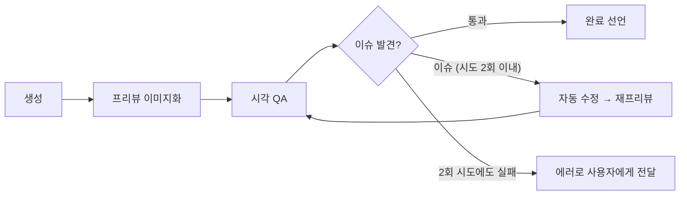

# FOLIOO 시각화 — 수정 가드레일 및 시각 QA

> 이 문서는 `pptx-gen-plan-v6.md` 의 **§5.4** 와 **§6** 을 분리한 것이다.
> 절 번호(§5.4.x, §6.x)는 원본 문서와의 교차참조 유지를 위해 그대로 둔다.
> 전체 실행 파이프라인은 `pptx-gen-plan-v6.md` §5, 비동기 처리는 §7 참조.

---

### 5.4 수정 가능 범위 (가드레일)

| 속성 | 수정 가능 | 제한 사항 |
|---|---|---|
| 폰트 크기 | ✅ | 10pt ~ 48pt |
| 폰트 색상 | ✅ | 브랜드 팔레트 내 |
| 도형 크기 | ✅ | 슬라이드 영역 내 |
| 도형 색상 | ✅ | 브랜드 팔레트 내 |
| 도형 위치 | ✅ | 슬라이드 영역 내 |
| 레이아웃 구조 변경 | ⚠️ 제한적 | 같은 카테고리 내 다른 템플릿으로 전환 |
| 텍스트 내용 변경 | ✅ | 사용자 명시 요청 시만, 아래 가드 규칙 준수 |
| 슬라이드 추가/삭제 | ❌ | 구조 변경 불가 |

#### 5.4.1 텍스트 내용 변경 가드 규칙

사용자가 "제목 더 임팩트 있게", "오타 고쳐줘", "이 문장 좀 짧게" 같이
**명시적으로 텍스트 변경을 요청한 경우만** 변경한다.

| 가드 | 규칙 |
|---|---|
| 변경 범위 | 사용자가 명시한 도형(shape_id) 만 (다른 도형은 절대 건드리지 마) |
| 길이 제한 | 사전 max_chars 없음 → 변경 후 시각 QA 가 오버플로우 감지 시 폰트 축소/요약으로 자동 보정 |
| 자동 후속 | 변경 후 시각 QA **강제 실행** (오버플로우 방지) |
| 의미 보존 | 모호한 요청("좀 더 멋있게")은 LLM이 해석하되 원본 의미 보존 |
| 일관성 | MVP에서는 단일 슬라이드 단위로만 변경 (다른 슬라이드의 동일 정보는 자동 동기화 X) |
| 차단 | 욕설·비속어·금칙어 필터링은 텍스트 탭과 동일 정책 적용 |

LLM 프롬프트 변경 (Phase 2 수정 호출):

```
[기존] "텍스트 내용은 바꾸지 마 (레이아웃/스타일만)"

[변경] "사용자가 텍스트 변경을 명시적으로 요청한 경우만 텍스트를 바꿔.
        그 외에는 레이아웃/스타일만 수정해.
        텍스트 변경 시:
        - 사용자가 지정한 도형(shape_id)만 변경 (다른 도형은 건드리지 마)
        - 도형이 화면 밖으로 나가거나 텍스트가 잘릴 만큼 길어지면 안 돼
          (길이 초과 가능성이 있으면 폰트 크기를 함께 줄여줘)
        - 부득이하게 텍스트를 요약/축약해야 할 경우, 숫자, 고유명사, 주요 성과 지표는 절대 삭제하지 마
        - 의미를 최대한 보존하면서 사용자 요청을 반영해"
```

**자동 텍스트 요약(축약) 시 가드레일 (MVP 정책)**:
텍스트 오버플로우로 인해 부득이하게 LLM이 텍스트를 자동 요약해야 할 경우, **"숫자, 고유명사(기술 스택 등), 주요 성과 지표는 절대 삭제하거나 변경하지 말 것"** 이라는 프롬프트 지시어를 통해서만 원본 훼손을 방지한다. MVP 단계에서는 UI 상의 별도 알림(뱃지) 없이 프롬프트 수준의 제어만 수행한다.

#### 5.4.2 향후 확장

- 슬라이드 간 동일 정보 자동 동기화 (예: cover 제목 변경 → toc 제목 자동 반영)
- 이전 수정 이력 기반 재생성 품질 향상 — 같은 슬라이드를 반복 재생성할 때 과거
  요청·해석을 LLM 컨텍스트로 제공 (수정 이력 저장소를 다시 추가해야 함)
- "되돌리기(undo)" 기능 (수정 이력 저장소를 다시 추가해야 함)

---

## 6. 시각 QA 시스템

Anthropic PPTX 스킬의 핵심 프로세스 중 하나. 자동으로 결과물을 시각적으로 검증한다.

### 6.1 QA 프로세스

```python
class VisualQA:

    def check_slide(self, slide_image_path: str,
                    expected_content: dict) -> dict:

        prompt = f"""이 PPT 슬라이드 이미지를 검사해줘.

체크리스트:
1. 텍스트가 영역 밖으로 넘치거나 잘리지 않았는가?
2. 요소들이 서로 겹치지 않는가?
3. 디자이너의 안내 텍스트가 그대로 남아있지 않는가?
   (예: "여기에 프로젝트명", "Text Box 2" 같은 미교체 흔적)
4. 텍스트가 읽기 어려울 정도로 작지 않은가?
5. 전체적인 레이아웃 균형이 적절한가?

예상 내용 (Step 1 의 content_brief + Step 3 의 fills 요약):
- 슬라이드 요지: {expected_content.get('brief', 'N/A')}
- 채워진 주요 텍스트: {expected_content.get('texts_summary', 'N/A')[:200]}...

이슈가 있으면 목록으로, 없으면 "통과"로 답해줘."""

        result = call_llm_with_image(prompt, slide_image_path)
        return parse_qa_result(result)
```

### 6.2 Fix-and-Verify 루프



- Anthropic 스킬 문서 기준: **렌더→시각 QA 검증을 최소 한 번 거치기 전에는 성공 선언하지 말 것** (이슈가 없으면 그 1회 검증으로 통과, 있으면 fix-and-verify 반복)
- 재검증 시 **영향 받은 슬라이드만** 검사
