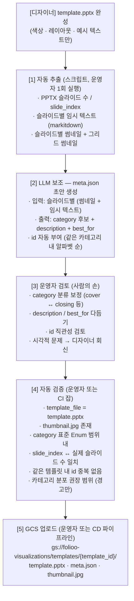

# FOLIOO 시각화 — 템플릿 시스템

> 이 문서는 `pptx-gen-plan-v6.md` 의 **§3** 을 분리한 것이다.
> 절 번호(§3.x)는 원본 문서와의 교차참조 유지를 위해 그대로 둔다.
> 기술 스택 및 OOXML 편집 방식은 `ooxml-editing.md`(§4) 참조.

## 3. 템플릿 시스템

### 3.1 템플릿 파일 구조

```
templates/
├── blue/
│   ├── template.pptx          ← 파란색 조합, 30~40장 Source Slide 풀
│   ├── meta.json              ← Source Slide 별 메타데이터
│   └── thumbnail.jpg          ← 그리드 썸네일 (런타임 선택 LLM/운영자 참고용)
├── green/
│   ├── template.pptx          ← 초록색 조합 (같은 레이아웃, 다른 색)
│   ├── meta.json
│   └── thumbnail.jpg
├── dark/
│   └── ...
└── (나중에) creative/          ← 완전 다른 디자인 시스템
    └── ...
```

### 3.2 하나의 Template PPTX 내부

```
templates/blue/template.pptx (30~40장의 Source Slide 풀)
├── Source Slide 1: 표지 레이아웃 A (cover_A)
├── Source Slide 2: 표지 레이아웃 B (cover_B)
├── Source Slide 3: 개요 레이아웃 A (overview_A)
├── Source Slide 4: 개요 레이아웃 B (overview_B)
├── Source Slide 5: 개요 레이아웃 C (overview_C)
├── Source Slide 6: 문제정의 레이아웃 A
├── Source Slide 7: 프로세스/타임라인 레이아웃 A
├── ...
├── Source Slide 30: 마무리 레이아웃 B
└── 모든 Source Slide 가 같은 마스터/테마/디자인 시스템 공유
```

### 3.3 Source Slide 카테고리 (표준 Enum)

카테고리는 **모든 Template 이 공유하는 글로벌 표준 Enum**으로 고정한다. Template 마다 자유롭게 정의하지 않는다.

**이유:**
- LLM 프롬프트에 "cover에서 1개, closing에서 1개 포함" 같은 규칙이 일관되게 작동해야 함
- Rule-based 사전 필터링(직전 Source Slide 와 같은 카테고리 제외 등)은 카테고리 정의가 일관돼야 가능
- 새 Template 이 추가될 때 매핑 로직이 폭발하지 않도록

**관리 방식:**
- `templates/_schema/categories.json` 에 표준 Enum 정의 (단일 소스 오브 트루스)
- 모든 Template 의 `meta.json`은 이 Enum 안의 값만 `category` 로 사용
- 템플릿 등록 스크립트에서 카테고리 유효성 검증

| 카테고리 키 | 설명 | 권장 변형 수 |
|---|---|---|
| `cover` | 프로젝트명, 이름, 날짜 (표지) | 3~4종 |
| `toc` | 전체 구성 한눈에 보기 (목차) | 2~3종 |
| `overview` | 배경, 기간, 역할, 팀 구성 (프로젝트 개요) | 3~4종 |
| `problem` | 문제 상황, 과제 설명 (문제 정의) | 2~3종 |
| `process` | 진행 과정, 단계별 설명 (프로세스/타임라인) | 3~4종 |
| `outcome` | 수치, KPI, Before/After (성과/결과) | 3~4종 |
| `chart` | 데이터 시각화 (도표/차트) | 4~5종 |
| `visual` | 스크린샷, 목업, 작업물 (이미지 중심) | 3~4종 |
| `text` | 회고, 러닝포인트 (텍스트 중심) | 2~3종 |
| `closing` | 감사, 연락처 (마무리) | 2~3종 |

신규 카테고리가 필요한 경우 → 별도 PR로 Enum 자체를 확장하고 모든 템플릿에 영향 범위를 검토.

### 3.4 메타데이터 파일 (meta.json) — **최소화**

> **설계 변경 (Anthropic PPTX 스킬 방식 채택)**
> 이전 버전에서는 디자이너가 각 도형에 표준 이름을 부여하고 `meta.json` 에
> 이전 설계의 placeholder 별 `name`, `type`, `purpose`, `max_chars` 까지 직접 적었다.
> **이 방식은 운영 부담이 너무 크다** (디자이너의 도형 이름 부여 + 후속 메타 수기 입력).
>
> Anthropic 의 PPTX 스킬이 그러하듯, **사전에 Slot 을 일일이 명시하지 않고**
> 런타임에 슬라이드 XML 자체를 LLM에게 컨텍스트로 제공해 자동 식별하는 방식으로 전환한다.
> `meta.json` 은 LLM의 **Source Slide 선택**(Source Slide 풀에서 어떤 페이지를 쓸지)에 필요한 최소 정보만 담는다.

```json
{
  "template_id": "blue",
  "template_file": "template.pptx",
  "theme": {
    "primary_color": "#4A6CF7",
    "name": "블루 클린"
  },
  "slides": [
    {
      "slide_index": 0,
      "id": "cover_A",
      "category": "cover",
      "description": "중앙 정렬 표지. 프로젝트명 + 이름 + 날짜. 심플한 느낌.",
      "best_for": "짧은 프로젝트명, 깔끔한 첫인상"
    },
    {
      "slide_index": 1,
      "id": "cover_B",
      "category": "cover",
      "description": "좌측 정렬 표지. 프로젝트명이 길 때 적합. 배경 이미지 영역 있음.",
      "best_for": "긴 프로젝트명, 시각적 임팩트 필요할 때"
    },
    {
      "slide_index": 2,
      "id": "overview_A",
      "category": "overview",
      "description": "4칸 카드형 개요. 역할/기간/도구/팀 구성을 카드로 분리.",
      "best_for": "구조화된 정보가 4개 항목일 때"
    }
    // ... 30~40개
  ]
}
```

빌더가 만든 초안에는 운영자 검토를 알리는 `_draft_notice` 가 추가될 수 있다.
런타임 Source Slide 선택에 쓰이는 각 Source Slide 엔트리는 다음 5개 필드만 유지한다:

| 필드 | 용도 |
|---|---|
| `slide_index` | Template PPTX 내부 Source Slide 순서 (0-based) |
| `id` | 등록 파이프라인이 자동 부여하고 운영자가 검토하는 Source Slide 식별자 (예: `cover_A`) |
| `category` | §3.3 표준 Enum 중 하나 |
| `description` | LLM 이 Source Slide 풀에서 선택할 때 참고하는 짧은 설명 |
| `best_for` | 어떤 콘텐츠에 적합한지 한 줄 가이드 |

**제거된 항목 (이전 버전 대비):**
- 이전 설계의 `placeholders[]` 배열 전체 — 도형 이름·max_chars·purpose 모두 사전 정의 X
- 디자이너의 도형 이름 부여 의무 — XML이 자동 생성하는 `cNvPr/@id` 만으로 충분

LLM 이 콘텐츠를 채워 넣을 때 필요한 Slot 정보는 `pptx-gen-plan-v6.md` §5.2 Step 3 에서
**시각화 워커가 슬라이드 XML 을 그 자리에서 분석해 동적으로 추출한다.**

### 3.5 템플릿 등록 파이프라인 (디자이너 ppt 완성 이후)

> **요약 — `meta.json` 은 "완전 자동 생성" 이 아니다.**
> `slide_index` 같은 기계적 필드는 자동 추출, `description` / `best_for` / `category` 같은
> 의미 필드는 **LLM 이 초안을 생성하고 운영자가 검토·확정**하는 반자동 방식이다.
> 디자이너가 도형 이름을 수기로 부여하거나 Slot 별 max_chars 를 작성하는 작업은 없다.

#### 3.5.1 전체 단계 한눈에



#### 3.5.2 실행 커맨드 예시

스크립트는 **운영자 로컬 또는 CI 잡**에서 실행한다. 런타임 시각화 워커는 이 단계에 관여하지 않는다.

```bash
# [1] + [2] 한 번에 실행 — meta.json 초안 생성
python scripts/templates/build_meta.py \
    --pptx ./templates/blue/template.pptx \
    --template-id blue \
    --primary-color "#4A6CF7" \
    --output ./templates/blue/meta.json

# 내부적으로 수행하는 일:
#   1) soffice 로 PDF 변환 후 pdftoppm 으로 슬라이드별 JPG 추출
#      (기본 위치: 배포 디렉터리 밖의 work dir, --work-dir 로 override 가능)
#   2) 그리드 썸네일 생성 (templates/blue/thumbnail.jpg)
#   3) markitdown 으로 슬라이드별 임시 텍스트 추출 (기본 위치: work dir/slide_text.md)
#   4) LLM 에 (썸네일 + 텍스트) 묶음 입력 →
#      슬라이드별 { category, description, best_for } 초안 생성
#   5) 같은 카테고리끼리 묶어 id 알파벳 자동 부여
#   6) meta.json 초안을 디스크에 작성 (운영자가 이후 수정 가능)

# [3] 운영자가 IDE 에서 meta.json 직접 검토/수정 (사람의 손)

# [4] 검증 — 운영자 또는 CI 잡에서 실행
python scripts/templates/validate_template.py ./templates/blue

# 검증 내용:
#   - meta.json 스키마 (필수 필드 누락 X)
#   - template_file 이 경로 없이 정확히 template.pptx 인지
#   - thumbnail.jpg 가 존재하고 비어 있지 않은지
#   - category 가 templates/_schema/categories.json 안에 있는지 (unknown 이면 실패 — 운영자가 실제 카테고리로 교체해야 통과)
#   - slide_index 가 0..N-1 연속인지, PPTX 내 슬라이드 수와 일치하는지
#   - 같은 템플릿 내 id 중복 없는지

# [5] 업로드
gcloud storage rsync ./templates/blue/ gs://folioo-visualizations/templates/blue/
```

#### 3.5.3 meta.json 필드별 생성 주체

| 필드 | 생성 주체 | 비고 |
|---|---|---|
| `template_id` | 운영자 (스크립트 인자) | "blue", "green" 등 |
| `template_file` | 자동 | 항상 `template.pptx` |
| `theme.primary_color` | 운영자 (스크립트 인자) | |
| `theme.name` | 운영자 또는 LLM 보조 | "블루 클린" 같은 한국어 표시명 |
| `slides[].slide_index` | **자동** | PPTX 파싱 |
| `slides[].id` | **LLM 자동 부여 → 운영자 검토** | 같은 카테고리 내 알파벳 순 |
| `slides[].category` | **LLM 초안 → 운영자 검토 필수** | §3.3 표준 Enum 한정 |
| `slides[].description` | **LLM 초안 → 운영자 다듬기** | 한 줄, Source Slide 풀 선택 시 LLM 참고 |
| `slides[].best_for` | **LLM 초안 → 운영자 다듬기** | 한 줄, 어떤 콘텐츠에 적합한지 |

→ **운영자가 절대 손대지 않는 필드: `slide_index`, `template_file`.**
→ **운영자가 반드시 검토하는 필드: `category` (잘못 분류되면 LLM 추천 풀이 망가짐).**

#### 3.5.4 메타 작성 보조 LLM 프롬프트 (참고)

```
System:
"너는 PPT 슬라이드 분류 전문가야. 슬라이드 썸네일과 임시 텍스트를 보고
 다음 표준 카테고리 중 하나로 분류해. 잘 모르겠으면 'unknown' 으로."

[표준 카테고리 목록 (§3.3)]
cover, toc, overview, problem, process, outcome, chart, visual, text, closing

User (슬라이드마다 반복):
"[슬라이드 N번 썸네일]
 [텍스트]: '여기에 프로젝트명', '2024.01 - 2024.06', ...

 다음 JSON 형식으로 출력해:
 {
   \"category\": \"...\",
   \"description\": \"한 줄로 레이아웃과 구성 요약 (35자 내외)\",
   \"best_for\": \"어떤 콘텐츠에 적합한지 한 줄 (35자 내외)\"
 }"
```

위 프롬프트는 `scripts/templates/build_meta.py` 안에서 슬라이드마다 한 번씩 호출된다.
빌드 단계의 LLM 호출이므로 **런타임 사용자 비용에는 영향 없음**.

#### 3.5.5 과거 버전 대비 제거된 작업

| 작업 | 이전 버전 | 현재 (v6) |
|---|---|---|
| 디자이너가 도형마다 영문 이름 부여 | 필수 | **제거** (런타임에 `cNvPr/@id` 자동 식별) |
| 이전 설계의 placeholder 별 `max_chars` 수기 입력 | 필수 | **제거** (시각 QA 가 사후 보정, §3.7.2) |
| 이전 설계의 placeholder 별 `name`/`type`/`purpose` JSON 작성 | 필수 | **제거** (`meta.json` 의 5개 필드만 유지) |
| 명명 검증 스크립트 (`scripts/validate_template.py` 의 이전 설계 placeholder 명명 검사) | 필수 | **제거** (검증 항목은 §3.5.1 [4] 로 단순화) |

### 3.6 디자인 일관성 보장

하나의 PPTX 파일 안에 모든 레이아웃이 있으므로:
- 마스터 슬라이드 / 슬라이드 레이아웃 공유
- 테마 색상, 폰트 패밀리 통일
- 도형 스타일, 그림자, 간격 등 디자이너가 한 번에 관리
- 어떤 조합으로 골라도 "같은 PPT 느낌" 보장

### 3.7 디자이너 워크플로우 — **단순화**

```
디자이너가 할 일:
1. PowerPoint에서 하나의 파일 열고
2. 다양한 레이아웃 페이지를 쭉 만들고
3. 각 Slot 후보 자리에 실제로 들어갈 콘텐츠와 비슷한 예시 텍스트 입력
   (예: "여기에 프로젝트명", "도구: Figma, Notion" 등 — LLM 이 의미를 이해할 단서)
4. 색상 바꿔서 다른 이름으로 저장 → 새 템플릿 파일
5. 색상별 template.pptx 를 운영자 등록 파이프라인에 전달

→ 도형마다 영문 이름을 부여하는 작업 X
→ max_chars 같은 후속 메타 수기 입력 X
→ 코드 몰라도 됨, PPT만 잘 만들면 됨
```

#### 3.7.1 자동 Slot 인식 원리

도형 이름(`cNvPr@name`) 에 약속된 키워드를 박지 않아도 동작한다. 그 이유:

- 모든 도형은 PowerPoint 가 자동 부여하는 **숫자 ID** 가 있다 — `<p:cNvPr id="3" name="..."/>`
  의 `id` 속성. **이 `id` 가 코드의 1차 식별자**.
- 시각화 워커는 슬라이드 XML 을 unpack 한 뒤, 텍스트가 들어있는 도형들을 자동으로 스캔해
  다음과 같은 **Slot 디스크립터** 를 만든다:
  ```json
  {
    "shape_id": "3",
    "shape_name": "TextBox 2",
    "x_emu": 685800, "y_emu": 457200,
    "w_emu": 7772400, "h_emu": 914400,
    "current_text": "여기에 프로젝트명",
    "is_title_placeholder": true,
    "font_size_pt": 40,
    "kind": "text"
  }
  ```
- 이 Slot 디스크립터들을 슬라이드의 Slot 카탈로그로 LLM 에 넘긴다.
  LLM 은 위치(좌표)·크기·현재 텍스트·폰트 크기를 보고 "이 Slot 은 제목이구나",
  "이 4 개 Slot 은 카드 본문이구나" 같은 역할을 **스스로 파악**한다.
- LLM 응답은 도형 이름이 아닌 `shape_id` 를 키로 사용한다.

```xml
<!-- 디자이너가 별도로 이름을 안 바꿔도 OK -->
<p:sp>
  <p:nvSpPr>
    <p:cNvPr id="3" name="TextBox 2"/>   <!-- ← name 은 PowerPoint 기본값 그대로 OK -->
  </p:nvSpPr>
  ...
  <p:txBody>
    <a:p><a:r><a:t>여기에 프로젝트명</a:t></a:r></a:p>
                <!-- ↑ 디자이너가 자유롭게 적은 안내 텍스트.
                     LLM 이 위치·폰트 크기와 함께 보고 역할을 추론 -->
  </p:txBody>
</p:sp>
```

#### 3.7.2 길이 초과·오버플로우 대응

이전 버전의 `max_chars` 사전 명시는 **사후 시각 QA + 폰트 자동 축소** 로 대체된다.

| 상황 | 처리 방식 |
|---|---|
| LLM 이 생성한 텍스트가 Slot 에 비해 길다 | Step 6 시각 QA 가 텍스트 잘림/오버플로우 감지 → fix-and-verify 루프에서 폰트 축소 또는 요약 |
| LLM 이 생성한 텍스트가 Slot 에 비해 짧다 | 폰트 자동 확대 또는 그대로 유지 (`pptx-gen-plan-v6.md` §16) |
| 도형 자체가 콘텐츠에 맞지 않음 (예: 카드 4개인데 콘텐츠는 3개) | 빈 Slot 에 해당하는 `<p:sp>` 전체 제거 (`ooxml-editing.md` §4.3 항목 수 불일치 규칙) |

→ 사전 제약(`max_chars`) 으로 LLM 출력을 막는 대신, **런타임에 결과를 보고 자동 조정** 한다.
이 방식은 Anthropic 스킬의 "완료 전 최소 한 번 시각 QA 검증" 원칙과 정확히 같은 철학이다.

#### 3.7.3 디자이너 가이드 — 권장 사항 (강제 아님)

LLM 이 Slot 역할을 더 잘 추론하도록, 디자이너가 PPTX 안에 적어두는 예시 텍스트는
**실제 콘텐츠 톤에 가까운 한국어 안내문** 을 권장한다:

| 안 좋은 예 | 좋은 예 |
|---|---|
| `Lorem ipsum...` | `여기에 프로젝트명 (20자 내외)` |
| `Text 1`, `Text 2` | `역할: ` / `기간: ` / `사용 도구: ` |
| 빈 텍스트박스 | `이 영역에는 핵심 성과 한 줄을 작성하세요` |

이는 강제 규칙이 아니며, 위반해도 동작은 한다. LLM 추론 정확도에 영향만 미친다.
