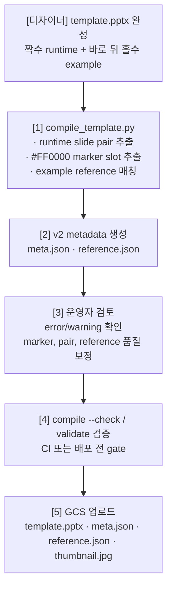

# FOLIOO 시각화 — 템플릿 시스템

> 이 문서는 `pptx-gen-plan-v6.md` 의 **§3** 을 분리한 것이다.
> 절 번호(§3.x)는 원본 문서와의 교차참조 유지를 위해 그대로 둔다.
> 기술 스택 및 OOXML 편집 방식은 `ooxml-editing.md`(§4) 참조.

## 3. 템플릿 시스템

### 3.1 템플릿 파일 구조

```
templates/
├── blue/
│   ├── template.pptx          ← 짝수/홀수 slide pair 를 담은 Source Slide 풀
│   ├── meta.json              ← v2 runtime slot 계약
│   ├── reference.json         ← v2 예시 slide 매칭/추론 근거
│   └── thumbnail.jpg          ← 그리드 썸네일 (런타임 선택 LLM/운영자 참고용)
├── green/
│   ├── template.pptx          ← 초록색 조합 (같은 레이아웃, 다른 색)
│   ├── meta.json
│   ├── reference.json
│   └── thumbnail.jpg
├── dark/
│   └── ...
└── (나중에) creative/          ← 완전 다른 디자인 시스템
    └── ...
```

### 3.2 하나의 Template PPTX 내부

```
templates/blue/template.pptx
├── Slide 1: 안내/검수용 슬라이드 (런타임 대상 아님)
├── Slide 2: runtime 유형 슬라이드 A
├── Slide 3: Slide 2 의 example/reference 슬라이드
├── Slide 4: runtime 유형 슬라이드 B
├── Slide 5: Slide 4 의 example/reference 슬라이드
├── Slide 6: runtime 유형 슬라이드 C
├── Slide 7: Slide 6 의 example/reference 슬라이드
├── ...
├── 짝수 slide: 포트폴리오 내용으로 교체될 유형 슬라이드
├── 바로 뒤 홀수 slide: 같은 레이아웃의 실제 예시/reference
└── 모든 Source Slide 가 같은 마스터/테마/디자인 시스템 공유
```

v2 compiler 는 **1-based 짝수 slide 를 runtime 유형 슬라이드**로 보고, 바로 뒤의
**1-based 홀수 slide 를 example/reference slide** 로 매칭한다. 마지막 짝수 slide 뒤에
example slide 가 없으면 계약 위반이다. 홀수 slide 는 editable 대상이 아니며, 예시 텍스트와
최종 텍스트 색상(`output_text_color`)을 추출하는 reference 로만 사용한다.

### 3.3 Source Slide 카테고리 (표준 Enum)

카테고리는 **모든 Template 이 공유하는 글로벌 표준 Enum**으로 고정한다. Template 마다 자유롭게 정의하지 않는다.

**이유:**
- LLM 프롬프트에 "cover에서 1개, closing에서 1개 포함" 같은 규칙이 일관되게 작동해야 함
- Rule-based 사전 필터링(직전 Source Slide 와 같은 카테고리 제외 등)은 카테고리 정의가 일관돼야 가능
- 새 Template 이 추가될 때 매핑 로직이 폭발하지 않도록

**관리 방식:**
- `templates/_schema/categories.json` 에 표준 Enum 정의 (단일 소스 오브 트루스)
- v2 `runtime_slides[]` 의 `category` 는 선택 보강값이다. 운영자가 추가하는 경우 이 Enum 안의 값을 사용한다.
- v2 validator 는 pair/marker/reference/layout 계약을 검증하고, category 는 누락 시 런타임 fallback 을 사용한다.
- legacy `slides[]` 형식의 `category` 는 템플릿 등록 스크립트에서 Enum 유효성을 검증한다.

| 카테고리 키 | 설명 | 권장 변형 수 |
|---|---|---|
| `cover` | 프로젝트명, 이름, 날짜 (표지) | 3~4종 |
| `toc` | 전체 구성 한눈에 보기 (목차) | 2~3종 |
| `overview` | 배경, 기간, 역할, 팀 구성 (프로젝트 개요) | 3~4종 |
| `problem` | 문제 상황, 과제 설명 (문제 정의) | 2~3종 |
| `process` | 진행 과정, 단계별 설명 (프로세스/타임라인) | 3~4종 |
| `outcome` | 수치, KPI, Before/After (성과/결과) | 3~4종 |
| `chart` | 데이터 시각화 (도표/차트) | 4~5종 |
| `visual` | 스크린샷, 목업, 작업물 (이미지 중심) | 3~4종 |
| `text` | 회고, 러닝포인트 (텍스트 중심) | 2~3종 |
| `closing` | 감사, 연락처 (마무리) | 2~3종 |

신규 카테고리가 필요한 경우 → 별도 PR로 Enum 자체를 확장하고 모든 템플릿에 영향 범위를 검토.

### 3.4 메타데이터 파일 (meta.json / reference.json) — **v2 계약**

`template.pptx` 가 source of truth 이고, `scripts/templates/compile_template.py` 가
`schema_version: 2` 형식의 `meta.json` 과 `reference.json` 을 생성한다. 런타임 로더는
`meta.json.schema_version != 2` 인 템플릿을 fail fast 한다.

```json
{
  "schema_version": 2,
  "template_id": "blue",
  "runtime_slides": [
    {
      "slide_index": 1,
      "slide_number": 2,
      "slide_filename": "slide2.xml",
      "slide_part": "ppt/slides/slide2.xml"
    }
  ],
  "slots": [],
  "layout_groups": []
}
```

`meta.json` 의 책임:

| 필드 | 용도 |
|---|---|
| `schema_version` | v2 계약 식별자. 값은 반드시 `2` |
| `template_id` | 템플릿 디렉터리명 기반 식별자 |
| `runtime_slides` | 실제 생성에 사용할 짝수 runtime slide 목록 |
| `slots` | editable marker 에서 추출한 slot descriptor 목록 |
| `layout_groups` | `inline_label_group` 같은 group 단위 layout 계약 |

`slots[]` 는 런타임 LLM prompt 와 deterministic fitting 의 입력이다. 주요 필드는
`slot_id`, `slide_index`, `slide_number`, `shape_id`, `shape_name`, `x_emu`, `y_emu`,
`w_emu`, `h_emu`, `kind`, `editable`, `required`, `allowed_actions`,
`marker_color`, `placeholder_text`, `font_size_pt`, `example_text`,
`example_char_count`, `example_line_count`, `output_text_color`, `min_font_pt`,
`max_font_pt`, `max_lines`, `nowrap`, `fit_policy`, `item_background`,
`layout_group_id` 이다.

`reference.json` 은 runtime 실행의 필수 입력이 아니라 compiler/validator/audit 용 근거 파일이다.
같은 `schema_version: 2` 와 `template_id` 를 가지며, `slide_pairs`, `shape_matches`,
`shape_inferences` 를 기록한다. `shape_matches` 는 example slide 에서 매칭한
`example_text` 와 `output_text_color` 의 출처이고, `shape_inferences` 는
`item_background`, `container_shape` 같은 추론 근거를 남긴다. `reference.json` 없이도
`meta.json` 만으로 기본 생성은 가능하지만, 품질 검수와 strict validator 에서는 함께 다룬다.

정확한 `#FF0000` marker 규칙:

- runtime slide 에서 **정확한 RGB `#FF0000` 텍스트 run** 만 editable slot 이다.
- `#FE0000`, theme red, tint/shade red 는 marker 가 아니다.
- 같은 shape 안에 `#FF0000` run 과 non-red run 이 섞일 수 있다. 이때 compiler 는
  `text_replacement_mode` 를 기록해 교체 범위를 구분한다.
- `text_replacement_mode: "marker_runs"` 는 non-red run 을 fixed/decorative 로 보존하고,
  `#FF0000` marker run 만 생성 텍스트로 교체한다.
- `text_replacement_mode: "shape"` 는 여러 marker segment 가 구분자와 함께 한 의미를 이룰 때
  shape 전체 텍스트를 하나의 placeholder 로 보고 교체한다. 예: `경험명 - 본인 역할`.
- `#FF0000` 은 최종 출력 색상이 아니라 editable marker 이다. 최종 text color 는
  example slide 의 `output_text_color` 로 대체한다.

### 3.5 템플릿 등록 파이프라인 (디자이너 ppt 완성 이후)

> **요약 — v2 `meta.json` / `reference.json` 은 `compile_template.py` 산출물이다.**
> 디자이너가 도형 이름을 수기로 부여하거나 Slot 별 `max_chars` 를 작성하지 않는다.
> 운영자는 PPTX pair convention 과 marker convention 을 지키고, 컴파일 결과의 warning/error 를 검토한다.

#### 3.5.1 전체 단계 한눈에



#### 3.5.2 실행 커맨드 예시

스크립트는 **운영자 로컬 또는 CI 잡**에서 실행한다. 런타임 시각화 워커는 이 단계에 관여하지 않는다.

```bash
uv run python scripts/templates/compile_template.py templates/blue
uv run python scripts/templates/compile_template.py templates/blue --check
uv run python scripts/templates/validate_template.py templates/blue
uv run python scripts/templates/validate_template.py templates/blue --strict
gcloud storage rsync ./templates/blue/ gs://folioo-visualizations/templates/blue/
```

#### 3.5.3 v2 필드별 생성 주체

| 필드 | 생성 주체 | 비고 |
|---|---|---|
| `schema_version` | 자동 | 항상 `2` |
| `template_id` | 자동 | 템플릿 디렉터리명 |
| `runtime_slides[]` | 자동 | 짝수 runtime slide 에서 추출 |
| `slots[].shape_id` / bbox | 자동 | runtime slide OOXML 의 `cNvPr/@id`, `a:xfrm` |
| `slots[].marker_color` | 자동 | 정확한 `#FF0000` marker 만 허용 |
| `slots[].placeholder_text` | 자동 | runtime slide 의 marker 텍스트 |
| `slots[].text_replacement_mode` | 자동 | mixed-color shape 의 교체 범위. `marker_runs` 또는 `shape` |
| `slots[].example_text` / `output_text_color` | 자동 | example slide reference 매칭 결과 |
| `slots[].fit_policy` / capacity 필드 | 자동 | layout group 과 slot geometry 기반 기본값 |
| `layout_groups[]` | 자동 | `inline_label_group` 등 group 추론 결과 |
| `reference.json` 의 match/inference | 자동 | 검수와 validator 용 근거 |

#### 3.5.4 과거 버전 대비 제거된 작업

| 작업 | 이전 버전 | 현재 (v6) |
|---|---|---|
| 디자이너가 도형마다 영문 이름 부여 | 필수 | **제거** (`cNvPr/@id` 자동 식별) |
| 이전 설계의 placeholder 별 `max_chars` 수기 입력 | 필수 | **제거** (`fit_policy`, `max_lines`, `nowrap` 등 자동 추론) |
| 이전 설계의 placeholder 별 `name`/`type`/`purpose` JSON 작성 | 필수 | **제거** (`#FF0000` marker 와 reference 매칭으로 추출) |
| 런타임에서 XML만 보고 slot 계약을 처음부터 추론 | 필수 | **제거** (`meta.json` 계약을 source of truth 로 사용하고, XML 추출값은 overlay/검증 입력으로만 사용) |

### 3.6 디자인 일관성 보장

하나의 PPTX 파일 안에 모든 레이아웃이 있으므로:
- 마스터 슬라이드 / 슬라이드 레이아웃 공유
- 테마 색상, 폰트 패밀리 통일
- 도형 스타일, 그림자, 간격 등 디자이너가 한 번에 관리
- 어떤 조합으로 골라도 "같은 PPT 느낌" 보장

### 3.7 디자이너 워크플로우 — **v2 pair convention**

```
디자이너가 할 일:
1. PowerPoint에서 하나의 파일 열고
2. 각 레이아웃을 "짝수 runtime slide + 바로 뒤 홀수 example slide" pair 로 구성
3. runtime slide 의 교체 대상 텍스트만 정확한 #FF0000 으로 표시
4. example slide 에 실제 출력에 가까운 예시 텍스트와 최종 색상 입력
5. 색상별 template.pptx 를 운영자 등록 파이프라인에 전달

→ 도형마다 영문 이름을 부여하는 작업 X
→ max_chars 같은 후속 메타 수기 입력 X
→ JSON 직접 편집 X
```

#### 3.7.1 자동 Slot 인식 원리

도형 이름(`cNvPr@name`) 에 약속된 키워드를 박지 않아도 동작한다. 그 이유:

- 모든 도형은 PowerPoint 가 자동 부여하는 **숫자 ID** 가 있다 — `<p:cNvPr id="3" name="..."/>`
  의 `id` 속성. **이 `id` 가 코드의 1차 식별자**.
- v2 compiler 는 runtime slide XML 을 unpack 한 뒤, 정확한 `#FF0000` run 만 스캔해
  다음과 같은 **Slot 디스크립터** 를 `meta.json.slots[]` 에 만든다:
  ```json
  {
    "slot_id": "slide2_shape3",
    "shape_id": "3",
    "marker_color": "#FF0000",
    "placeholder_text": "사용 기술",
    "example_text": "OpenAI API",
    "output_text_color": "#000000",
    "font_size_pt": 40,
    "fit_policy": "basic_text_area",
    "kind": "text"
  }
  ```
- `placeholder_text` 는 LLM prompt 의 1차 content hint 이다. `role_hint` 가 없어도
  `placeholder_text`, `example_text`, 위치/크기, `fit_policy` 로 생성이 가능해야 한다.
- LLM 응답과 `currentFills` 는 도형 이름이 아닌 `shape_id` 를 키로 사용한다.
- OOXML 레벨에서는 `cNvPr/@id` 가 `shape_id` 이고, `srgbClr val="FF0000"` run 만
  editable marker 로 인정한다. `cNvPr/@name` 은 참고용 힌트일 뿐 계약 키가 아니다.
- mixed-color shape 는 run 구조에 따라 `text_replacement_mode` 를 추가한다.
  - non-red fixed text 안에 하나의 red marker segment 가 있으면 `marker_runs` 로 기록한다.
    런타임은 non-red run 을 그대로 두고 red marker run 만 교체한다.
  - non-red 구분자를 사이에 둔 여러 red marker segment 가 있으면 `shape` 로 기록한다.
    이때 `placeholder_text` 는 전체 shape 텍스트다. 예: `경험명 - 본인 역할`.

#### 3.7.2 길이 초과·오버플로우 대응

이전 버전의 수기 `max_chars` 는 v2 metadata 의 capacity hint 와 deterministic fitting 으로 대체된다.

| 상황 | 처리 방식 |
|---|---|
| LLM 이 생성한 텍스트가 Slot 에 비해 길다 | `fit_policy`, `min_font_pt`, `max_lines`, `nowrap` 기준으로 축소·요약·실패를 결정 |
| inline label/chip 이 길어진다 | `layout_groups` 와 `item_background` 로 `layout_actions` 를 계산 |
| 도형 자체가 콘텐츠에 맞지 않음 | 빈 Slot 은 `currentFills[shape_id].action = "remove"` 로 제거 |

`layout_actions` 는 워커 내부 geometry 조정이고, `currentFills` 에 섞지 않는다. `currentFills` 는
텍스트/삭제/차트 fill 상태만 표현한다. 상세 책임 경계는 `ooxml-editing.md` §4.4 참조.

#### 3.7.3 디자이너 가이드 — 필수/권장 사항

| 구분 | 규칙 |
|---|---|
| 필수 | runtime slide 의 editable 텍스트는 정확한 `#FF0000` |
| 필수 | 각 runtime slide 바로 뒤에 같은 레이아웃의 example slide 배치 |
| 권장 | bullet `-`, 라벨, 구분자처럼 결과에도 남아야 하는 텍스트는 non-red run 으로 둔다 |
| 권장 | 하나의 값만 교체하고 주변 fixed text 를 보존하려면 red marker segment 를 1개로 유지한다 |
| 권장 | `경험명 - 본인 역할` 처럼 여러 marker 조각이 한 문장을 이룰 때는 example slide 에 완성형 예시를 넣는다 |
| 권장 | example slide 텍스트는 실제 포트폴리오 출력 톤에 가깝게 작성 |
| 권장 | chip/label 배경은 text slot 을 감싸는 작은 별도 shape 로 유지 |
| 금지 | 최종 출력에서 빨간색을 원한다는 의미로 `#FF0000` 사용 |

| 안 좋은 예 | 좋은 예 |
|---|---|
| bullet 까지 빨간색으로 칠함 | black `- ` + red `세부 업무` |
| `경험명 - 본인 역할` 의 example 이 placeholder 그대로임 | `Folioo - 백엔드 개발` 같은 완성형 예시 입력 |
| runtime slide 에 theme red marker 사용 | 정확한 RGB `#FF0000` 사용 |
| example slide 를 생략 | runtime/example pair 유지 |

위 필수 규칙을 어기면 compiler/validator 가 실패해야 한다. 권장 규칙 위반은 품질 warning 또는
생성 품질 저하로 이어질 수 있으므로, 필요한 경우 운영자가 template.pptx 또는 example slide 를 보정한다.
