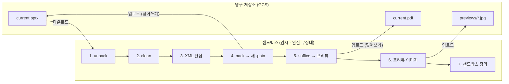

# FOLIOO 시각화 — 워커 사양 및 인프라 구조 (샌드박스 · 비용 · soffice 운영)

> 이 문서는 `pptx-gen-plan-v6.md` 의 **§8** 을 분리한 것이다.
> 절 번호(§8.x)는 원본 문서와의 교차참조 유지를 위해 그대로 둔다.
> 워커 실행 환경·큐 핸들러 패턴은 `worker-runtime.md`(§7.0.1–7.0.2),
> GCS 저장소 구조는 `pptx-gen-plan-v6.md` §9 참조.

---

## 8. 인프라 구조

### 8.1 샌드박스 기반 처리

모든 파일 작업은 **임시 샌드박스**에서 수행하고, 완료 후 정리한다. 샌드박스는 완전 무상태(stateless).



### 8.2 연산 비용 분석

```
┌────────────────────────┬──────────┐
│ 연산                    │ 소요 시간 │
├────────────────────────┼──────────┤
│ GCS 다운로드/업로드        │ ~0.5-1초 │
│ unpack                  │ ~0.1초   │
│ clean                   │ ~0.1초   │
│ XML 편집                │ ~0.01초  │
│ pack + validate         │ ~0.3초   │
│ soffice → PDF           │ ~2-5초   │
│ pdftoppm → JPG          │ ~0.5초   │
│ LLM 호출                │ ~3-10초  │
├────────────────────────┼──────────┤
│ 전체 수정 사이클          │ ~7-17초  │
│ unpack/pack 비중         │ ~3%     │
└────────────────────────┴──────────┘

→ 병목은 LLM 호출과 soffice 변환
→ unpack/pack 오버헤드는 무시 가능
```

### 8.3 시각화 워커 사양 및 soffice 운영

soffice(LibreOffice headless) 변환은 메모리·디스크 사용이 가장 많은 단계.
**시각화 워커**(GCP Cloud Run Service) 의 사양과 운영 정책을 별도로 다룬다.

#### 8.3.1 soffice 메모리 프로파일

| 상황 | 예상 RSS |
|---|---|
| Idle (프로세스 시작 직후) | 150-300 MB |
| 텍스트 위주 (7~12장) | 300-500 MB |
| 이미지 포함 (스크린샷·목업 다수) | 600 MB ~ 1 GB |
| 고밀도 (12장 / 고해상도 차트·이미지) | 1-2 GB |

특이 사항:
- **메모리 누수 경향**: 같은 soffice 프로세스로 변환을 반복하면 RSS가 점진 증가 → N회마다 프로세스 재시작 권장
- **사용자 프로필 충돌**: 기본 `~/.config/libreoffice/` 공유 → 동시 실행 시 락 충돌
- **콜드스타트**: 프로세스 시작에 1~3초 (JVM/UNO 초기화)
- **폰트 의존성**: 시스템 미설치 폰트는 fallback 또는 □□□ 처리

#### 8.3.2 워커 토폴로지 옵션

**옵션 A: 단일 시각화 워커, 전체 파이프라인 통합 (MVP 권장)**

```
시각화 워커 (Cloud Run, 4GB / 2 vCPU)
├─ Cloud Tasks Push 핸들러 (HTTP)
├─ LLM 호출 (네트워크 IO, ~수십 MB)
├─ XML 편집 (~수십 MB)
├─ pack/unpack (~100 MB)
└─ soffice 변환 (1-2 GB 피크)
```

- 장점: 단순, 파일 핸드오프 X, 디버깅 쉬움
- 단점: LLM 호출 동안(전체 시간의 60%+) 메모리 idle

**옵션 B: 파이프라인 2단계 분리 (확장 시)**

```
LLM 워커 (1 GB)            Render 워커 (4 GB)
├─ Step 1~3 처리           ├─ Step 4~7 처리
└─ Cloud Tasks hop ────────┘
```

- 장점: LLM과 soffice 동시성을 독립 스케일, soffice OOM이 LLM에 영향 X
- 단점: 복잡도 ↑, GCS 핸드오프 필요, Cloud Tasks hop 레이턴시
- 도입 시점: 동시 처리 수가 10~20개를 넘기 시작할 때

#### 8.3.3 soffice 실행 플래그 (필수)

```bash
soffice \
  --headless \
  --nologo --nofirststartwizard --nodefault \
  --norestore --nocrashreport --nolockcheck \
  -env:UserInstallation=file:///tmp/soffice-${PID}-${UUID} \
  --convert-to pdf:impress_pdf_Export \
  --outdir /tmp/output \
  /tmp/input.pptx
```

핵심:
- **`UserInstallation` 격리 필수** — 동시 실행 시 프로필 디렉터리 충돌 방지
- 변환 종료 후 `/tmp/soffice-${PID}-${UUID}` 디렉터리 삭제
- Anthropic의 `soffice.py` 헬퍼는 이 부분 + UNIX 소켓 우회 추상화

#### 8.3.4 운영 체크리스트

| 항목 | 권장 정책 |
|---|---|
| 변환 타임아웃 | 잠정 30~60초(§8.3.6 부하 테스트로 확정). 초과 시 SIGKILL + 1회 재시도 |
| 워커 재활용 | 20회 변환 후 인스턴스 자체 종료 → Cloud Run / Cloud Tasks 가 새 인스턴스 띄움 |
| 컨테이너 메모리 limit | 권장값 + 30% 여유 (예: 4 GB 권장 → limit 5 GB) |
| OOM 감지 | cgroup `memory.events` / `oom_kill` 카운터 모니터링 |
| 임시 디스크 | `/tmp` 1 GB+ 확보. 변환 후 즉시 cleanup |
| 한글 폰트 | Noto Sans CJK / Pretendard 사전 설치 (컨테이너 이미지에 포함) |
| Java 힙 캡 | `JAVA_TOOL_OPTIONS=-Xmx512m` 로 LibreOffice 내부 JVM 한도 설정 |
| Cloud Run 인스턴스 동시 요청 수 | `concurrency = 1` (soffice 멀티스레드 안전성 약함) |
| Cloud Run min-instances | 0 (유휴 비용 0; 콜드스타트는 비동기라 체감 작음, 민감하면 1) |

#### 8.3.5 컨테이너 이미지 (참고)

```dockerfile
FROM ubuntu:22.04

ENV DEBIAN_FRONTEND=noninteractive

RUN apt-get update && apt-get install -y --no-install-recommends \
      libreoffice-impress \
      libreoffice-core \
      poppler-utils \
      fonts-noto-cjk \
      fonts-noto-cjk-extra \
      python3 python3-pip \
      ca-certificates \
    && rm -rf /var/lib/apt/lists/*

RUN pip3 install defusedxml lxml pillow google-cloud-storage google-cloud-tasks fastapi uvicorn markitdown
```

이미지 크기: ~700 MB - 1 GB.
- Cloud Run: pull 캐시되므로 콜드스타트 영향 미미 (N회 재활용 종료 후 새 인스턴스도 노드 캐시 hit)

#### 8.3.6 부하 테스트 시나리오 (배포 전 필수)

워커 사양 결정용 측정.

| 케이스 | PPTX 특성 | 예상 RSS 피크 |
|---|---|---|
| Light | 7장 / 텍스트 위주 / 표지+개요 | ~350 MB |
| Medium | 10장 / 차트 2~3개 / 이미지 1~2개 | ~600 MB |
| Heavy | 12장 / 스크린샷·목업 다수 (5MB+ 이미지) | ~1.0 GB |
| Worst | 12장 / 고해상도 이미지 + 차트 + 표 최대 | ~1.5 GB |

각 케이스를 단일 워커에서 5회 연속 변환 → RSS 추이로 메모리 누수 여부 확인.

※ 출력은 7~12장(§5.2 규칙 4)이라 soffice 변환 대상은 최대 12장이다. unpack 직후엔 템플릿
원본(30~40장)이 잠시 메모리에 있으나, 미선택 슬라이드는 변환 전 §5.2 Step 2 에서 제거된다.

#### 8.3.7 모니터링 메트릭

| 메트릭 | 목적 |
|---|---|
| `soffice_rss_bytes` | 메모리 피크 추적 |
| `soffice_conversion_duration_seconds{quantile}` | 성능 회귀 감지 (P50/P95/P99) |
| `soffice_conversion_failures_total{reason}` | 타임아웃/OOM/기타 실패 분류 |
| `worker_oom_kill_total` | 컨테이너 OOM 빈도 (즉시 알람) |
| `worker_jobs_processed_total` | 워커 재활용 시점 결정 |
| `tmp_disk_bytes_used` | 임시 파일 누수 감지 |
| `font_fallback_warnings_total` | 폰트 누락 감지 (새 템플릿 추가 시) |

워커는 `GET /metrics` 에 Prometheus text exposition 형식으로 위 지표를 노출한다.
서비스 전체가 Cloud Run require-auth 대상이므로, 외부 스크레이퍼는 워커 호출 권한이 있는
서비스 계정으로 OIDC 토큰을 붙여 호출한다. `soffice_conversion_failures_total{reason}` 의
라벨 값은 `timeout`, `oom`, `other` 로 고정한다(`other` 는 기타 실패).
이 failure counter 는 기존 spec 메트릭명을 유지하되, 실제 집계 범위는 soffice 래퍼의 렌더
수명주기이므로 `pdftoppm` 실패도 `other` 로 포함될 수 있다.
`worker_jobs_processed_total` 은 `/health.lifetime_processed` 와 같은 런타임 카운터를 읽고,
`worker_ready_for_recycle` 은 `/health.ready_for_recycle` 과 같은 기준으로 0/1 gauge 를 노출한다.

**알람 기준 예시:**
- 렌더링 지연: `max_over_time(soffice_conversion_duration_seconds{quantile="0.95"}[5m]) > 30`
  → 5분 지속 시 경고. 워커 용량 부족, 템플릿 고밀도화, LibreOffice 회귀를 확인한다.
- OOM: `increase(worker_oom_kill_total[1m]) > 0` 또는
  `increase(soffice_conversion_failures_total{reason="oom"}[1m]) > 0`
  → 즉시 알람. Cloud Run 메모리 한도와 템플릿 이미지 용량을 확인한다.
- timeout/기타 실패 증가:
  `increase(soffice_conversion_failures_total{reason=~"timeout|other"}[5m]) > 0`
  → 경고. 변환 timeout, 손상된 PPTX, pdftoppm 실패를 확인한다.
- 폰트 fallback:
  `increase(font_fallback_warnings_total[5m]) > 0`
  → 폰트 누락 알림. 템플릿 사용 폰트와 컨테이너 설치 폰트를 대조한다.
- 임시 디스크:
  `tmp_disk_bytes_used > 800 * 1024 * 1024`
  → 경고. `/tmp` cleanup 누수 또는 과도한 렌더 산출물을 확인한다.
- 재활용 신호:
  `worker_ready_for_recycle == 1`
  → 정보성 지표. `worker_jobs_processed_total` 이 재활용 임계값에 도달한 정상 신호다.

#### 8.3.8 MVP 추천 사양 요약

| 항목 | 값 |
|---|---|
| 시각화 워커 환경 | **GCP Cloud Run Service** (HTTP 엔드포인트 노출) |
| 메모리 | 4 GB (limit 5 GB) |
| CPU | 2 vCPU |
| 임시 디스크 | 1 GB+ (`/tmp`) |
| 인스턴스 당 동시 요청 수 | `concurrency = 1` (soffice 멀티스레드 안전성 약함) |
| 오토스케일 | Cloud Run 자동 (min 0, max 20). max 는 Cloud Tasks `maxConcurrentDispatches` 와 일치 |
| 콜드스타트 대비 | `min-instances = 0` — 비동기 백그라운드라 첫 작업 콜드스타트 허용 (민감하면 1) |
| 인스턴스 재활용 | 20회 변환 후 자체 종료 (워커 코드에서 카운터 관리) |
| 변환 타임아웃 | 잠정 30~60초(§8.3.6 으로 확정) + 1회 재시도 |
| 요청 timeout | 1800s (30분 — Cloud Tasks dispatchDeadline 상한과 일치) |
| 큐 (외부) | GCP Cloud Tasks (단일 큐 `viz-jobs`, OIDC 인증) |
